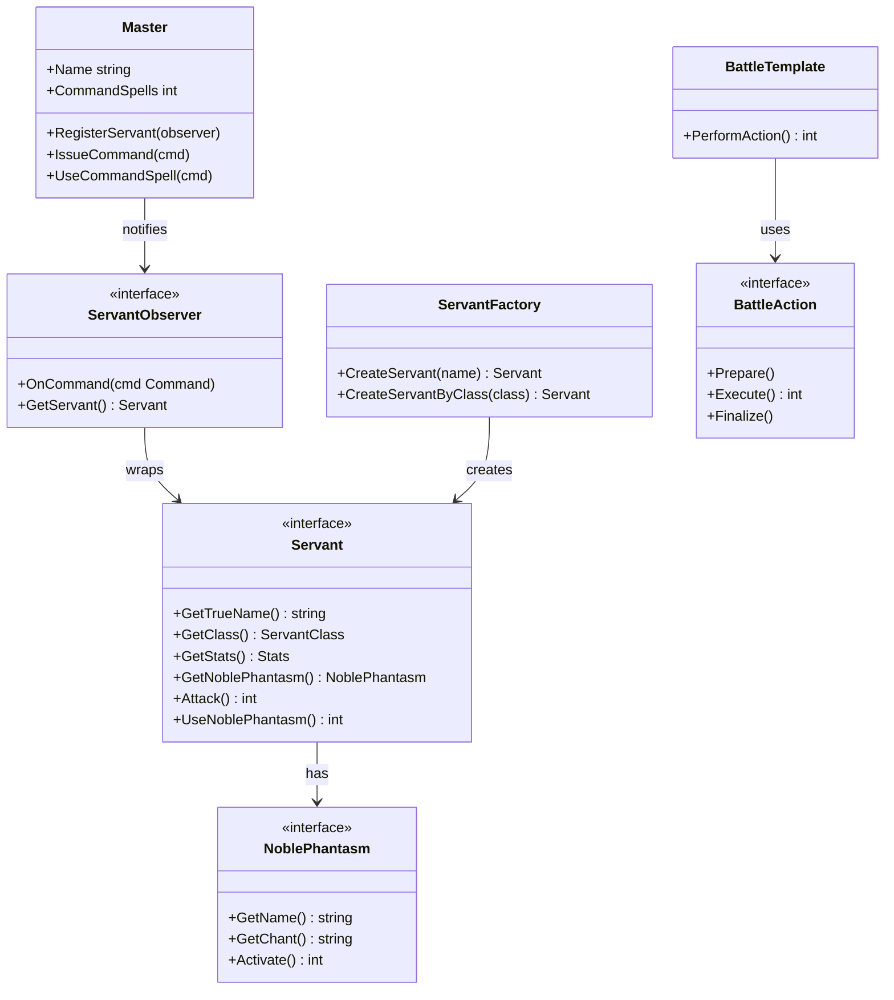
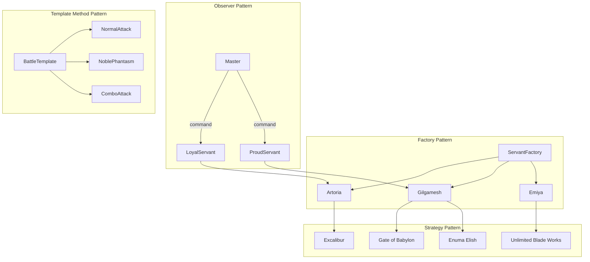

# Fate/Design Pattern - サーヴァントシミュレーター

Fateシリーズのサーヴァントを題材に、Goのデザインパターンを学ぶデモプロジェクトです。

## 実装されたデザインパターン

### 1. Strategy Pattern（戦略パターン）

**ファイル**: `noble_phantasm.go`

宝具（Noble Phantasm）の実装に使用。各サーヴァントが異なる宝具を持ち、動的に切り替え可能です。

```go
// NoblePhantasm インターフェース
type NoblePhantasm interface {
    GetName() string
    GetChant() string
    Activate() int
}

// 具体的な宝具実装
type Excalibur struct{}      // エクスカリバー
type GaeBolg struct{}        // ゲイ・ボルク
type UnlimitedBladeWorks struct{} // 無限の剣製
```

| 宝具 | サーヴァント | 説明 |
|-----|------------|------|
| エクスカリバー | アルトリア | 約束された勝利の剣 |
| ゲイ・ボルク | クー・フーリン | 刺し穿つ死棘の槍 |
| 無限の剣製 | エミヤ | 固有結界 |
| 王の財宝 | ギルガメッシュ | ゲート・オブ・バビロン |
| エヌマ・エリシュ | ギルガメッシュ | 天地乖離す開闘の星 |
| 王の軍勢 | イスカンダル | アイオニオン・ヘタイロイ |

---

### 2. Factory Pattern（ファクトリーパターン）

**ファイル**: `servant.go`

サーヴァントの生成を一元管理。名前またはクラスでサーヴァントを召喚できます。

```go
factory := &ServantFactory{}

// 名前で召喚
artoria := factory.CreateServant("アルトリア")
gilgamesh := factory.CreateServant("ギルガメッシュ")

// クラスで召喚
saber := factory.CreateServantByClass(ClassSaber)
lancer := factory.CreateServantByClass(ClassLancer)
```

| クラス | デフォルトサーヴァント |
|-------|---------------------|
| Saber | アルトリア・ペンドラゴン |
| Archer | エミヤ |
| Lancer | クー・フーリン |
| Rider | イスカンダル |

---

### 3. Template Method Pattern（テンプレートメソッドパターン）

**ファイル**: `battle.go`

バトルアクションの共通処理を定義し、具体的な行動はサブクラスで実装します。

```go
// バトルの流れ: Prepare → Execute → Finalize
type BattleAction interface {
    Prepare()
    Execute() int
    Finalize()
}

// 具体的なアクション
type NormalAttackAction struct{}    // 通常攻撃
type NoblePhantasmAction struct{}   // 宝具攻撃
type ComboAttackAction struct{}     // コンボ攻撃
```

```
========== バトルアクション開始 ==========
アルトリア・ペンドラゴン（Saber）が構えを取る...  ← Prepare
アルトリア・ペンドラゴン（Saber）の通常攻撃！    ← Execute
攻撃完了。体勢を整える。                        ← Finalize
========== 与ダメージ: 1500 ==========
```

---

### 4. Observer Pattern（オブザーバーパターン）

**ファイル**: `master.go`

マスターとサーヴァントの契約関係を表現。マスターからの命令をサーヴァントに通知します。

```go
// マスター（Subject）
type Master struct {
    Name          string
    CommandSpells int  // 令呪
    servants      []ServantObserver
}

// サーヴァント（Observer）
type ServantObserver interface {
    OnCommand(cmd Command)
    GetServant() Servant
}
```

#### サーヴァントの性格による反応の違い

| タイプ | 実装 | 特徴 |
|-------|-----|------|
| 通常 | `ContractedServant` | 標準的な反応 |
| 忠誠心が高い | `LoyalServant` | 騎士道精神に基づく反応（セイバー向け） |
| 誇り高い | `ProudServant` | 王としての威厳ある反応（ギルガメッシュ向け） |

```
[マスター: 遠坂時臣] 命令を発行: 撤退
[ギルガメッシュ] 撤退だと？この王に逃げろと？...貴様、後で話がある
```

---

## 実行方法

```bash
cd demo/fate_servant
go run ./cmd/main.go
```

## クラス図



## 各パターンの関係



## ファイル構成

```
demo/fate_servant/
├── go.mod              # モジュール定義
├── README.md           # このファイル
├── noble_phantasm.go   # Strategy Pattern - 宝具
├── servant.go          # Factory Pattern - サーヴァント
├── battle.go           # Template Method Pattern - バトル
├── master.go           # Observer Pattern - マスター
└── cmd/
    └── main.go         # デモ実行ファイル
```
