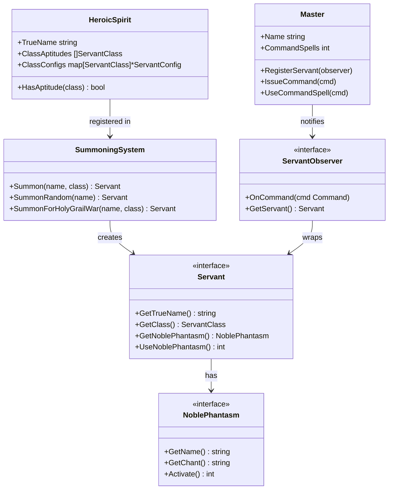
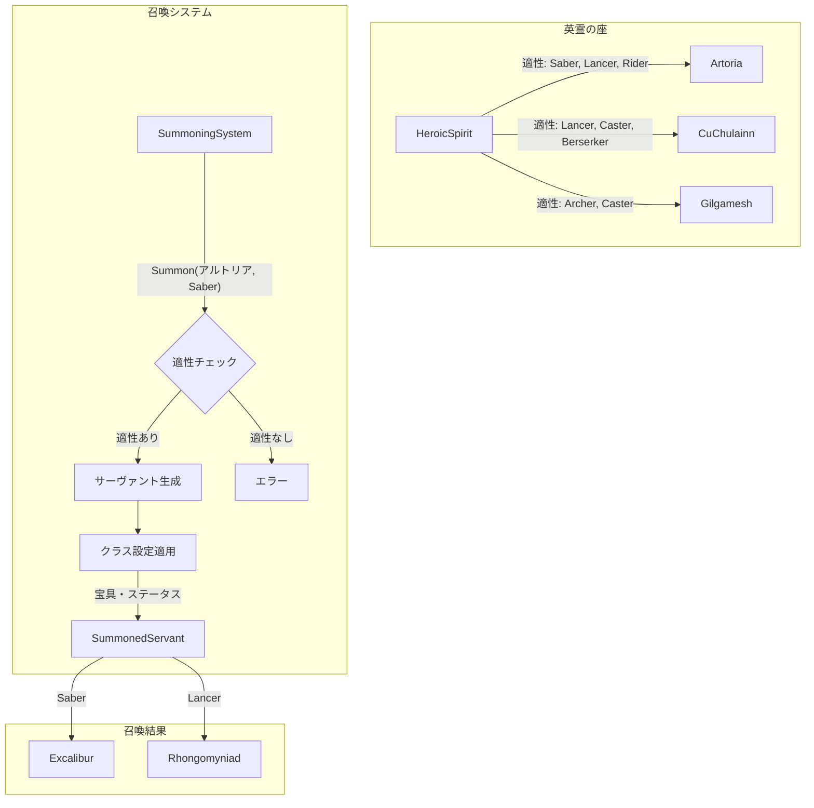

# Fate/Design Pattern - サーヴァントシミュレーター

Fateシリーズのサーヴァントを題材に、Goのデザインパターンを学ぶデモプロジェクトです。

## Fateシリーズとは

**Fate/stay night** を原点とするTYPE-MOON制作のメディアミックス作品群です。

物語の中心となるのは「聖杯戦争」と呼ばれる儀式。7人の魔術師（マスター）が、過去の英雄や伝説上の人物を「サーヴァント」として召喚し、万能の願望機「聖杯」を巡って戦います。

### 主要な概念

| 用語 | 説明 |
|-----|------|
| **サーヴァント** | 英霊（過去の英雄）が現界した存在。英霊ごとに生前の逸話に基づく「クラス適性」があり、召喚時に適性のあるクラス（Saber, Archer, Lancer, Rider, Caster, Assassin, Berserker）のいずれかに確定する |
| **マスター** | サーヴァントを召喚・契約した魔術師。令呪でサーヴァントに絶対命令を下せる |
| **宝具（Noble Phantasm）** | サーヴァントの切り札。生前の逸話や伝説が具現化した必殺技 |
| **令呪** | マスターに与えられる3画の絶対命令権。使い切ると契約が弱まる |

このプロジェクトでは、これらの概念をデザインパターンで表現しています。

---

## 実装されたFateの設定

### クラス適性システム

英霊は固定のクラスを持つのではなく、生前の逸話に基づく**クラス適性**を持ちます。召喚時に適性のあるクラスのいずれかに確定します。

```go
// 英霊の定義
type HeroicSpirit struct {
    TrueName       string
    ClassAptitudes []ServantClass                  // クラス適性
    ClassConfigs   map[ServantClass]*ServantConfig // クラスごとの設定
}

// 召喚システム
summonSystem := NewSummoningSystem()

// アルトリアはSaber, Lancer, Riderの適性を持つ
artoriaSaber, _ := summonSystem.Summon("アルトリア", ClassSaber)
artoriaLancer, _ := summonSystem.Summon("アルトリア", ClassLancer)

// 適性のないクラスへの召喚はエラー
_, err := summonSystem.Summon("イスカンダル", ClassSaber) // エラー: Rider適性のみ
```

#### 登録されている英霊とクラス適性

| 英霊 | クラス適性 | 備考 |
|-----|-----------|------|
| アルトリア・ペンドラゴン | Saber, Lancer, Rider | 剣（エクスカリバー）、槍（ロンゴミニアド）、騎乗 |
| クー・フーリン | Lancer, Caster, Berserker | 槍の英雄、ドルイドの知識、狂戦士化 |
| エミヤ | Archer, Assassin | 弓、暗殺 |
| ギルガメッシュ | Archer, Caster | 宝物の射出、賢王としての側面 |
| イスカンダル | Rider | 征服王の騎乗 |

### クラスによる宝具・ステータスの変化

同じ英霊でもクラスによって宝具とステータスが異なります。

| 英霊 | クラス | 宝具 |
|-----|-------|------|
| アルトリア | Saber | エクスカリバー（約束された勝利の剣） |
| アルトリア | Lancer | ロンゴミニアド（最果てにて輝ける槍） |
| アルトリア | Rider | ラムレイ（白銀の騎馬） |
| クー・フーリン | Lancer | ゲイ・ボルク（刺し穿つ死棘の槍） |
| クー・フーリン | Caster | ウィッカーマン（灼き尽くす炎の檻） |
| クー・フーリン | Berserker | クリード・コインヘン（噛み砕く死牙の獣） |

### 聖杯戦争ルール

聖杯戦争では同一クラスのサーヴァントは1騎のみ。既に枠が埋まっているクラスには召喚できません。

```go
holyGrailWar := NewSummoningSystem()

// Saberの枠を埋める
holyGrailWar.SummonForHolyGrailWar("アルトリア", ClassSaber) // 成功

// 同じSaberの枠には召喚不可
holyGrailWar.SummonForHolyGrailWar("エミヤ", ClassSaber) // エラー: 枠が埋まっている
```

---

## 実装されたデザインパターン

### 1. Strategy Pattern（戦略パターン）

**ファイル**: `noble_phantasm.go`

宝具（Noble Phantasm）の実装に使用。各サーヴァントが異なる宝具を持ち、動的に切り替え可能です。

```go
// NoblePhantasm インターフェース
type NoblePhantasm interface {
    GetName() string
    GetChant() string
    Activate() int
}

// 具体的な宝具実装
type Excalibur struct{}      // エクスカリバー
type GaeBolg struct{}        // ゲイ・ボルク
type UnlimitedBladeWorks struct{} // 無限の剣製
```

---

### 2. Factory Pattern（ファクトリーパターン）

**ファイル**: `heroic_spirit.go`

召喚システムとして実装。英霊の座（レジストリ）から英霊を取得し、指定クラスで召喚します。

```go
// 召喚システム
summonSystem := NewSummoningSystem()

// 英霊を指定クラスで召喚
artoria, err := summonSystem.Summon("アルトリア", ClassSaber)

// 適性クラスからランダムに召喚
servant, err := summonSystem.SummonRandom("クー・フーリン")

// 聖杯戦争用召喚（同一クラス重複不可）
servant, err := summonSystem.SummonForHolyGrailWar("ギルガメッシュ", ClassArcher)
```

---

### 3. Template Method Pattern（テンプレートメソッドパターン）

**ファイル**: `battle.go`

バトルアクションの共通処理を定義し、具体的な行動はサブクラスで実装します。

```go
// バトルの流れ: Prepare → Execute → Finalize
type BattleAction interface {
    Prepare()
    Execute() int
    Finalize()
}

// 具体的なアクション
type NormalAttackAction struct{}    // 通常攻撃
type NoblePhantasmAction struct{}   // 宝具攻撃
type ComboAttackAction struct{}     // コンボ攻撃
```

```
========== バトルアクション開始 ==========
アルトリア・ペンドラゴン（Saber）が構えを取る...  ← Prepare
アルトリア・ペンドラゴン（Saber）の通常攻撃！    ← Execute
攻撃完了。体勢を整える。                        ← Finalize
========== 与ダメージ: 1500 ==========
```

---

### 4. Observer Pattern（オブザーバーパターン）

**ファイル**: `master.go`

マスターとサーヴァントの契約関係を表現。マスターからの命令をサーヴァントに通知します。

```go
// マスター（Subject）
type Master struct {
    Name          string
    CommandSpells int  // 令呪
    servants      []ServantObserver
}

// サーヴァント（Observer）
type ServantObserver interface {
    OnCommand(cmd Command)
    GetServant() Servant
}
```

#### サーヴァントの性格による反応の違い

| タイプ | 実装 | 特徴 |
|-------|-----|------|
| 通常 | `ContractedServant` | 標準的な反応 |
| 忠誠心が高い | `LoyalServant` | 騎士道精神に基づく反応（セイバー向け） |
| 誇り高い | `ProudServant` | 王としての威厳ある反応（ギルガメッシュ向け） |

```
[マスター: 遠坂時臣] 命令を発行: 撤退
[ギルガメッシュ] 撤退だと？この王に逃げろと？...貴様、後で話がある
```

---

## 実行方法

```bash
cd demo/fate_servant
go run ./cmd/main.go
```

## クラス図



## 召喚フロー



## ファイル構成

```
demo/fate_servant/
├── go.mod              # モジュール定義
├── README.md           # このファイル
├── heroic_spirit.go    # 英霊・召喚システム（クラス適性）
├── noble_phantasm.go   # Strategy Pattern - 宝具
├── servant.go          # サーヴァント基本実装
├── battle.go           # Template Method Pattern - バトル
├── master.go           # Observer Pattern - マスター
└── cmd/
    └── main.go         # デモ実行ファイル
```
