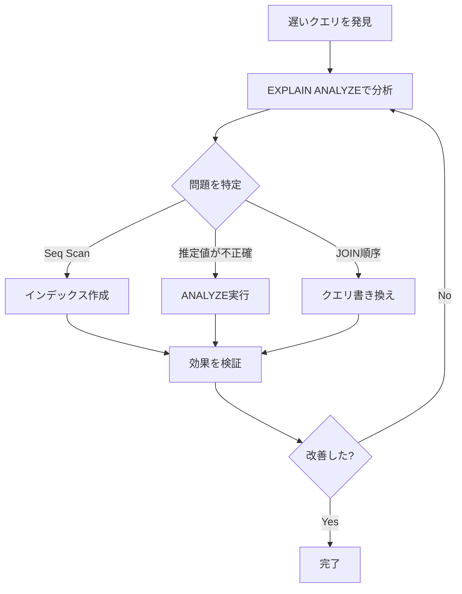

# PostgreSQL EXPLAIN 学習教材

PostgreSQLのEXPLAINコマンドを使ったクエリ最適化を、実際に手を動かして学べる教材セットです。

## 🎯 この教材で学べること

- EXPLAINコマンドの基本的な使い方
- 実行計画の読み方・分析方法
- インデックスの効果的な使い方
- クエリのパフォーマンスチューニング
- 実務で使える最適化テクニック

## 📚 教材の構成

### 1. クイックスタート（初心者向け）🚀

**対象:** EXPLAINを初めて使う方

[docs/explain_quickstart.md](./explain_quickstart.md)

5分で基本をマスター！最小限の知識で今すぐ始められます。

**内容:**
- 3ステップで始めるEXPLAIN
- 実行計画を読む3つのポイント
- インデックスで高速化する実例
- よく使うコマンド集
- 5分間チャレンジ

```bash
# クイックスタートを読む
cat docs/explain_quickstart.md
```

---

### 2. 実践的な読み方ガイド（重要）📖

**対象:** 実行計画を実際にどう読み、どう活用するかを学びたい方

[docs/explain_practical_examples.md](./explain_practical_examples.md)

**⭐️ 最も重要な教材！** 実際の出力例を使って、どこを見て、どう判断するかを詳しく解説します。

**内容:**
- 基本的な読み方（ステップバイステップ）
- 実践例1: Seq Scanの問題を発見して解決
- 実践例2: JOINの最適化（実行順序の理解）
- 実践例3: 推定値と実測値の乖離への対処
- 実践例4: インデックスが使われない理由
- 実践例5: 複合インデックスの活用
- Before/After比較で効果を確認

```bash
# 実践ガイドを読む
cat docs/explain_practical_examples.md
```

---

### 3. 実践演習SQL（手を動かす）💪

**対象:** 手を動かして学びたい方

[demo/explain_demo/examples.sql](../demo/explain_demo/examples.sql)

14個の実践例と練習問題で、実際にSQLを実行しながら学びます。

**内容:**
- 基本的なEXPLAIN / EXPLAIN ANALYZE
- WHERE句でのフィルタリング
- インデックスの効果確認
- 大量データでのパフォーマンス比較
- JOIN操作の実行計画
- 集約クエリ（GROUP BY）
- 複合インデックスの活用
- サブクエリの最適化
- 詳細オプション（BUFFERS, VERBOSE）
- パフォーマンスチューニング
- 統計情報の確認
- インデックスの使用状況
- 練習問題

**使い方:**
```bash
# PostgreSQLに接続
docker exec -it go-demo-db psql -U postgres -d go_demo

# SQLファイルの内容をコピー＆ペーストで実行
# または
\i /path/to/examples.sql
```

---

### 4. 完全ガイド（詳細解説）📚

**対象:** 深く理解したい方

[docs/postgresql_explain_guide.md](./postgresql_explain_guide.md)

理論から実践まで、EXPLAINの全てを網羅した完全ガイドです。

**内容:**
- EXPLAINとは
- 基本的な使い方
- EXPLAIN ANALYZEの違い
- 実行計画の読み方
- 主要なノードタイプ
  - Seq Scan
  - Index Scan / Index Only Scan
  - Bitmap Scan
  - Nested Loop / Hash Join / Merge Join
  - Aggregate / Sort
- 実践例（プロジェクトのテーブルを使用）
- パフォーマンスチューニング
  - よくある問題と対策
  - インデックス戦略
  - 実行計画のチェックリスト
- 実践的なワークフロー
- 便利なSQLスニペット集

```bash
# ガイドを読む
cat docs/postgresql_explain_guide.md
```

---

### 5. Goデモプログラム（開発者向け）🔧

**対象:** プログラムから実行したい方

[demo/explain_demo/](../demo/explain_demo/)

Goプログラムから自動的にEXPLAINを実行して結果を確認できます。

**内容:**
- 基本的なSELECT
- WHERE句でのフィルタリング
- インデックスの効果比較
- JOIN操作
- 集約クエリ
- 大量データでのパフォーマンス
- 複合インデックス

**使い方:**
```bash
cd demo/explain_demo
go run main.go
```

---

## 🚀 クイックスタート

### ステップ1: 環境準備

```bash
# プロジェクトルートで実行
cd /Users/isurugi_k/dev/private/go/go-demo

# PostgreSQLコンテナ起動
docker compose up -d db

# スキーマとダミーデータ投入
make refresh-schema
```

### ステップ2: PostgreSQLに接続

```bash
docker exec -it go-demo-db psql -U postgres -d go_demo
```

### ステップ3: 最初のEXPLAINを実行

```sql
-- 実行計画を見る
EXPLAIN SELECT * FROM users;

-- 実際に実行して実測値も見る
EXPLAIN ANALYZE SELECT * FROM users;
```

🎉 おめでとうございます！EXPLAINの第一歩を踏み出しました！

---

## 📖 推奨学習パス

### 初心者向け（所要時間: 1時間）

1. **[クイックスタート](./explain_quickstart.md)** を読む（5分）
2. PostgreSQLに接続して基本コマンドを試す（10分）
3. **[実践的な読み方ガイド](./explain_practical_examples.md)** の例1〜2を読む（30分）⭐️
4. **[実践演習SQL](../demo/explain_demo/examples.sql)** の例1〜5を実行（15分）

### 中級者向け（所要時間: 3時間）

1. **[実践的な読み方ガイド](./explain_practical_examples.md)** を全部読む（60分）⭐️
2. **[完全ガイド](./postgresql_explain_guide.md)** を読む（30分）
3. **[実践演習SQL](../demo/explain_demo/examples.sql)** の全例を実行（60分）
4. 練習問題に取り組む（30分）

### 実務で使う

1. 遅いクエリを見つける
   ```sql
   -- スロークエリログを有効化
   ALTER DATABASE go_demo SET log_min_duration_statement = 1000;
   ```

2. EXPLAINで分析
   ```sql
   EXPLAIN ANALYZE <遅いクエリ>;
   ```

3. 問題を特定
   - Seq Scanが不適切に使われていないか
   - 推定行数と実測行数は近いか
   - JOINの方法は適切か

4. 改善策を実施
   - インデックス作成
   - クエリの書き換え
   - 統計情報の更新

5. 効果を検証
   ```sql
   EXPLAIN ANALYZE <改善後のクエリ>;
   ```

---

## 🔍 よくある質問

### Q: どれから始めればいいですか？

**A:** まずは **[クイックスタート](./explain_quickstart.md)** をお勧めします。5分で基本が理解できます。

### Q: 実際に手を動かして学びたいです

**A:** **[実践演習SQL](../demo/explain_demo/examples.sql)** が最適です。PostgreSQLに接続して、例をコピー＆ペーストするだけです。

### Q: 深く理解したいです

**A:** **[完全ガイド](./postgresql_explain_guide.md)** で詳細を学べます。理論から実践まで網羅しています。

### Q: インデックスを作ったのに使われません

**A:** よくある原因:
1. 統計情報が古い → `ANALYZE table_name;` を実行
2. テーブルが小さすぎる → Seq Scanの方が速い場合もある
3. 大部分の行を取得している → インデックスより全件スキャンの方が効率的

### Q: 推定行数と実測行数が全然違います

**A:** 統計情報を更新してください:
```sql
ANALYZE table_name;
```

それでも改善しない場合:
```sql
ALTER TABLE table_name ALTER COLUMN column_name SET STATISTICS 1000;
ANALYZE table_name;
```

---

## 💡 実務のヒント

### パフォーマンス改善の基本フロー



### チェックリスト

パフォーマンス問題を調査する際は、以下を確認:

- [ ] `EXPLAIN ANALYZE`で実測値を確認
- [ ] Execution Timeは許容範囲か？
- [ ] Seq Scanは適切か？
- [ ] インデックスは使われているか？
- [ ] 推定行数と実測行数は近いか？
- [ ] JOINの方法は適切か？
- [ ] 不要なソートはないか？
- [ ] メモリ不足でディスクを使っていないか？

### 覚えておくべき3つのコマンド

```sql
-- 1. 実行計画を確認
EXPLAIN ANALYZE <クエリ>;

-- 2. インデックスを作成
CREATE INDEX idx_name ON table_name(column);

-- 3. 統計情報を更新
ANALYZE table_name;
```

---

## 🛠️ ツールとリソース

### オンラインツール

- [explain.depesz.com](https://explain.depesz.com/) - 実行計画の可視化
- [pgMustard](https://www.pgmustard.com/) - 実行計画の分析
- [explain.dalibo.com](https://explain.dalibo.com/) - グラフィカルな可視化

### PostgreSQL公式ドキュメント

- [EXPLAIN](https://www.postgresql.org/docs/current/sql-explain.html)
- [Performance Tips](https://www.postgresql.org/docs/current/performance-tips.html)
- [Indexes](https://www.postgresql.org/docs/current/indexes.html)

### 便利なクエリ

```sql
-- 使われていないインデックスを発見
SELECT
    schemaname || '.' || tablename AS table,
    indexname AS index,
    idx_scan AS scans
FROM pg_stat_user_indexes
WHERE idx_scan = 0 AND indexrelname NOT LIKE '%pkey'
ORDER BY pg_relation_size(indexrelid) DESC;

-- テーブルサイズ確認
SELECT
    tablename,
    pg_size_pretty(pg_total_relation_size(schemaname||'.'||tablename)) AS size
FROM pg_tables
WHERE schemaname = 'public'
ORDER BY pg_total_relation_size(schemaname||'.'||tablename) DESC;
```

---

## 📝 まとめ

この教材セットで学べること:

✅ EXPLAINコマンドの基本的な使い方
✅ 実行計画の読み方と分析方法
✅ インデックスの効果的な活用
✅ クエリのパフォーマンスチューニング
✅ 実務で使える最適化テクニック

次のステップ:

1. **[クイックスタート](./explain_quickstart.md)** で基本を学ぶ
2. **[実践演習](../demo/explain_demo/examples.sql)** で手を動かす
3. **[完全ガイド](./postgresql_explain_guide.md)** で深く理解する
4. 実際のプロジェクトで実践する

---

## 🙋 フィードバック

この教材についてのフィードバックや改善提案があれば、ぜひお聞かせください！

Happy Query Optimization! 🚀
