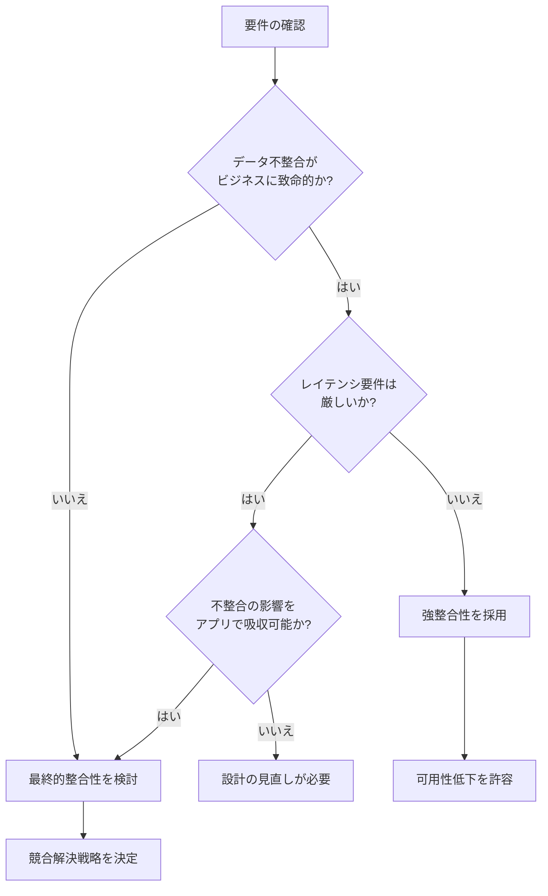

# 最終的整合性と強整合性 - 分散システムの設計判断ガイド

## 一言で言うと

**強整合性**は「全員が常に同じデータを見る」、**最終的整合性**は「いずれ全員が同じデータを見る（一時的な不一致を許容）」という違いがある。

---

## なぜ整合性モデルの理解が必要か

### 解決する課題

分散システムでは、データを複数のノードに分散・複製する。このとき避けられない問いが発生する：

> 「ノードAに書き込んだデータを、ノードBはいつ・どのように見えるべきか？」

この問いへの答え方が整合性モデルであり、以下のトレードオフを決定づける：

- **可用性**: システムがリクエストに応答できるか
- **レイテンシ**: 応答にどれだけ時間がかかるか
- **正確性**: 読み取るデータがどれだけ最新か

### 歴史的背景

- **2000年**: Eric BrewerがCAP定理を提唱（Consistency、Availability、Partition toleranceの3つのうち2つしか同時に満たせない）
- **2008年**: AmazonがDynamoの論文で最終的整合性を採用し、高可用性システムの設計指針を示した
- **2012年**: CAP定理の再解釈が進み、「CAPはトレードオフの連続体」という理解が広まった

---

## 両者の特徴

### 強整合性（Strong / Linearizable Consistency）

**定義**: 書き込みが完了した瞬間から、すべての読み取りが最新の値を返す。

```
時間軸: ──────────────────────────────────>
         │                │
      書き込み完了      以降の全読み取りで
      (write X=1)      X=1 が保証される
```

| メリット | デメリット |
|---------|-----------|
| プログラミングモデルが単純 | レイテンシが高い（同期待ち） |
| データ不整合によるバグがない | 可用性が低下しやすい |
| トランザクション処理に適する | スケールしにくい |

**実現方法の例**:
- 2フェーズコミット（2PC）
- Paxos / Raft などの合意アルゴリズム
- 単一リーダーレプリケーション（同期書き込み）

### 最終的整合性（Eventual Consistency）

**定義**: 更新が停止すれば、いずれすべてのノードが同じ値に収束する。収束までの間は古い値が読まれる可能性がある。

```
時間軸: ──────────────────────────────────────────>
         │              │                    │
      書き込み完了   一部ノードは古い値    全ノード収束
      (write X=1)   を返す可能性あり     (X=1が確定)
                    ← 不整合ウィンドウ →
```

| メリット | デメリット |
|---------|-----------|
| 高可用性（書き込み即応答） | 古いデータを読む可能性 |
| 低レイテンシ | 競合解決ロジックが必要 |
| 地理分散に強い | アプリケーション側の考慮が増える |

**実現方法の例**:
- 非同期レプリケーション
- CRDTs（Conflict-free Replicated Data Types）
- ゴシッププロトコル

---

## 設計判断のフローチャート



---

## 典型的なユースケース

### 強整合性が適するケース

| ユースケース | 理由 |
|------------|------|
| 銀行口座の残高 | 二重引き落としや過剰引き出しを防ぐ |
| 在庫管理（売り切れ判定） | 在庫0の商品を売ってはいけない |
| 座席予約システム | 同じ座席の二重予約を防ぐ |
| 分散ロック | リソースの排他制御が必須 |

### 最終的整合性が適するケース

| ユースケース | 理由 |
|------------|------|
| SNSのいいね数 | 一時的な誤差は許容できる |
| DNSの名前解決 | TTLで古い情報が残っても実害が小さい |
| ショッピングカート | 最悪の場合は後で修正できる |
| ユーザーのオンライン状態 | 数秒の遅延は許容される |

---

## 技術面接で問われる観点

### Q1: 「なぜこの整合性モデルを選んだのか？」

回答のポイント:
1. **ビジネス要件**: 不整合が発生した場合の影響度
2. **SLA**: レイテンシ・可用性の要件
3. **スケール**: 地理分散の有無、書き込み頻度

```
良い回答例:
「このシステムではユーザーのプロフィール更新を扱います。
数秒程度の反映遅延は許容できる一方、グローバルに展開するため
低レイテンシが重要です。よって最終的整合性を採用し、
読み取り時に古いデータが返る可能性をUIで吸収しています」
```

### Q2: 「最終的整合性で競合が発生したらどうする？」

主な競合解決戦略:

| 戦略 | 説明 | 適用例 |
|-----|------|-------|
| Last Write Wins (LWW) | タイムスタンプが新しい方を採用 | 単純な上書き操作 |
| マージ | 両方の変更を統合 | ドキュメント共同編集 |
| アプリケーション解決 | ユーザーに選択させる | Gitのconflict |
| CRDTs | 数学的に競合しないデータ型 | カウンター、セット |

### Q3: 「CAP定理との関係は？」

```
ネットワーク分断時:
├── 強整合性を選ぶ → 一部ノードが応答不能（可用性を犠牲）
└── 最終的整合性を選ぶ → 古いデータで応答（整合性を犠牲）

重要: 分断がないときはCP/APの選択は不要。
      分断が発生したときの挙動を事前に決めておくことが重要。
```

---

## 実装例（概念コード）

### 強整合性：同期レプリケーション

```go
func Write(key, value string) error {
    // 全レプリカに書き込み、過半数のACKを待つ
    acks := 0
    for _, replica := range replicas {
        if replica.Write(key, value) == nil {
            acks++
        }
    }
    if acks < len(replicas)/2+1 {
        return errors.New("write failed: quorum not reached")
    }
    return nil
}
```

### 最終的整合性：非同期レプリケーション

```go
func Write(key, value string) error {
    // ローカルに書き込み、即座に応答
    if err := local.Write(key, value); err != nil {
        return err
    }
    // バックグラウンドで他レプリカに伝播
    go func() {
        for _, replica := range replicas {
            replica.Write(key, value) // 失敗してもリトライキューへ
        }
    }()
    return nil
}
```

---

## まとめ

| 観点 | 強整合性 | 最終的整合性 |
|-----|---------|-------------|
| データの見え方 | 常に最新 | 一時的に古い可能性 |
| レイテンシ | 高い | 低い |
| 可用性 | 低い | 高い |
| 実装の複雑さ | 合意アルゴリズム | 競合解決ロジック |
| 適するワークロード | 金融、予約、ロック | SNS、キャッシュ、ログ |

**設計判断の本質**: どちらが「正しい」ではなく、ビジネス要件とトレードオフを理解した上で、意図を持って選択することが重要。
