# CORS（Cross-Origin Resource Sharing）解説ガイド

## 目次

1. [CORSとは](#corsとは)
2. [歴史と背景](#歴史と背景)
3. [同一オリジンポリシー](#同一オリジンポリシー)
4. [CORSが解決する課題](#corsが解決する課題)
5. [CORSの仕組み](#corsの仕組み)
6. [プリフライトリクエスト](#プリフライトリクエスト)
7. [CORSヘッダー](#corsヘッダー)
8. [セキュリティ上の注意点](#セキュリティ上の注意点)
9. [トラブルシューティング](#トラブルシューティング)

---

## CORSとは

CORS（Cross-Origin Resource Sharing、オリジン間リソース共有）は、ブラウザが異なるオリジンのサーバーからリソースを取得することを許可するための仕組みです。

### CORSで防げるもの・防げないもの

CORSはブラウザのセキュリティ機能であり、すべての攻撃を防ぐわけではありません。その役割と限界を正しく理解することが重要です。

#### ✅ CORSで防げるもの
CORSは **JavaScriptによるクロスオリジンのレスポンス読み取り** を制御します。
これにより、以下の脅威を防ぐことができます：

| 攻撃・脅威 | 説明 | なぜ防げるか |
|-----------|------|-------------|
| **悪意あるサイトからのデータ窃取** | `evil.com` のスクリプトが `bank.com` のAPIからユーザーの口座情報を読み取る | ブラウザがレスポンスの読み取りをブロックする。サーバーが許可していないオリジンはデータを取得できない |
| **認証情報を悪用したデータ取得** | 攻撃者サイトがユーザーのCookieを使って認証済みAPIにアクセスし、レスポンスを読み取る | `Access-Control-Allow-Credentials` と具体的なオリジン指定が必要。ワイルドカード（`*`）では認証情報付きリクエストは許可されない |
| **プライベートAPIへの不正アクセス** | 社内向けAPIに外部サイトからアクセスしてデータを取得する | CORSヘッダーがなければ、ブラウザがレスポンスをブロックする |
| **機密性の高いレスポンスヘッダーの漏洩** | カスタムヘッダーに含まれる機密情報の読み取り | `Access-Control-Expose-Headers` で明示的に許可しない限り、JavaScriptからアクセスできない |

#### ❌ CORSで防げないもの
CORSは**レスポンスの読み取り**を制御するため、以下の攻撃は防げません：

| 攻撃・脅威 | 説明 | なぜ防げないか |
|-----------|------|---------------|
| **CSRF（クロスサイトリクエストフォージェリ）** | 攻撃者サイトがユーザーの認証情報を使って、銀行振込などの操作を実行させる | CORSは**レスポンスの読み取り**を制御するが、**リクエストの送信自体は止められない**。シンプルリクエスト（GET/POST）は送信される |
| **サーバー側での処理実行** | DELETEリクエストでデータが削除される（プリフライト未対応サーバー） | プリフライトはCORS対応サーバーのみ正しく動作する。未対応サーバーはOPTIONSを無視して処理を実行する可能性がある |
| **サーバー間通信（Server-to-Server）** | バックエンドサーバーから別のAPIへの直接アクセス | CORSはブラウザのみが強制する仕組み。`curl`、サーバーサイドコード、Postman等はCORSの影響を受けない |
| **``、`<script>`、`<form>` タグによる攻撃** | 画像タグやスクリプトタグを使ったリクエスト送信 | これらのタグはCORS以前から存在し、クロスオリジンリクエストが許可されている。後方互換性のため制限できない |
| **XSS（クロスサイトスクリプティング）** | 悪意あるスクリプトがサイト内に注入され、同一オリジンとして実行される | XSSが成功すると、攻撃スクリプトは被害サイトと同一オリジンで動作する。CORSは同一オリジンの通信には関与しない |
| **DNSリバインディング攻撃** | DNSを操作して、攻撃者のドメインを被害者のIPに解決させる | オリジンのホスト名は同じなので、CORSのチェックをすり抜ける |
| **ブラウザ以外からのアクセス** | APIを直接叩くスクリプトやツール | CORSはブラウザの機能。他のHTTPクライアントはCORSを無視できる |

#### 重要な注意点

```
⚠️ CORSはセキュリティの「一部」であり「全部」ではない

CORSだけに頼らず、以下の対策も併用すること：
- CSRF対策: CSRFトークン、SameSite Cookie
- 認証・認可: 適切なトークン検証、権限チェック
- 入力検証: サーバー側でのバリデーション
- レート制限: 過剰なリクエストの制限
```

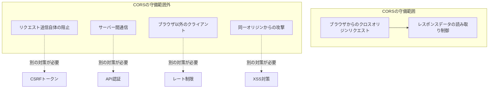

### オリジンの定義

オリジンは以下の3つの要素の組み合わせで決まります：

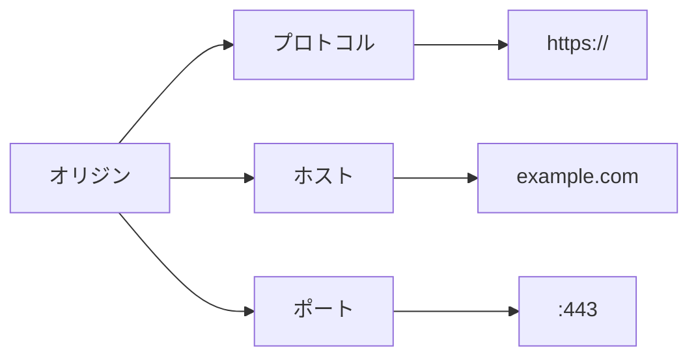

| URL | オリジン |
|-----|---------|
| `https://example.com/page` | `https://example.com` |
| `https://example.com:443/page` | `https://example.com` |
| `http://example.com/page` | `http://example.com` |
| `https://api.example.com/data` | `https://api.example.com` |

### なぜこの3要素でオリジンを定義するのか

- **プロトコル**: `http` と `https` では通信の暗号化有無が異なり、セキュリティレベルが違う。混在させると中間者攻撃のリスクがある
- **ホスト**: 異なるホストは異なる管理者・組織が運営している可能性がある。`example.com` と `evil.com` を同一視するのは危険
- **ポート**: 同一ホストでも異なるポートでは異なるアプリケーションが動作している可能性がある。ポート80のWebサーバーとポート8080の管理画面を同一視すると危険

### 同一オリジンと異なるオリジン

`https://example.com` から見た場合：

| URL | 同一オリジン？ | 理由 |
|-----|--------------|------|
| `https://example.com/other` | ✅ 同一 | パスのみ異なる |
| `https://example.com:443/other` | ✅ 同一 | 443はHTTPSのデフォルト |
| `http://example.com/page` | ❌ 異なる | プロトコルが異なる |
| `https://example.com:8080/page` | ❌ 異なる | ポートが異なる |
| `https://api.example.com/page` | ❌ 異なる | ホストが異なる |

---

## 歴史と背景

### Webの進化とセキュリティの課題

| 年 | 出来事 | 意義 |
|---|--------|-----|
| 1995 | Netscape Navigator 2.0 リリース | JavaScript誕生。Webに動的な機能が加わる |
| 1996 | 同一オリジンポリシー導入 | セキュリティの基盤確立。クロスオリジンのスクリプトアクセスを制限 |
| 2004 | XMLHttpRequest普及 | Ajax時代の幕開け。ページ遷移なしでサーバーと通信可能に |
| 2005 | JSONP登場 | クロスオリジン通信の回避策。しかしセキュリティ上の問題あり |
| 2009 | CORS仕様策定開始 | W3Cワーキングドラフト。安全なクロスオリジン通信の標準化 |
| 2014 | CORS仕様勧告 | W3C正式勧告。ブラウザでの実装が進む |
| 2014〜 | Fetch API登場 | モダンなHTTP通信API。CORSを前提とした設計 |

### なぜCORSが生まれたか

#### 1. Web 1.0時代（1990年代）
- Webページは静的なコンテンツが中心
- サーバーから一方的にHTMLを配信
- クロスオリジン通信の必要性は低かった

#### 2. Ajax時代（2000年代）- 同一オリジンポリシーが障壁に

XMLHttpRequestの普及により、ページ遷移なしでサーバーと通信できるようになった。しかし同一オリジンポリシーにより、以下の正当なユースケースが制限された：

| 制限されたユースケース | なぜ正当か |
|---------------------|----------|
| APIサーバーとの通信 | フロントエンド（`www.example.com`）とAPI（`api.example.com`）を分離したい。スケーラビリティ、保守性、チーム分離のため |
| サードパーティAPIの利用 | Google Maps、天気API等を自分のサイトから呼び出したい |
| CDNからのデータ取得 | 静的ファイルをCDNから配信してパフォーマンス向上したい |

**なぜ同一オリジンポリシーは厳格すぎたのか**：

同一オリジンポリシーは「すべてのクロスオリジン通信を禁止」という単純なルールだった。これは：
- 悪意のあるサイトからの攻撃を防ぐには有効
- しかし、正当なクロスオリジン通信と悪意ある通信を区別できない
- 開発者は回避策（JSONP等）に頼らざるを得なかった

#### 3. マッシュアップ時代（2005年〜）- JSONPの問題

複数のAPIを組み合わせたサービスが登場し、JSONP（JSON with Padding）という回避策が流行した。

**JSONPの仕組み**：
```html
<!-- scriptタグは同一オリジンポリシーの対象外 -->
<script src="https://api.example.com/data?callback=handleData"></script>
```

**なぜJSONPは問題だったのか**：
- `<script>` タグで読み込むため、任意のJavaScriptが実行される危険性
- サーバー側がJSONPに対応している必要がある
- GETリクエストしか使えない
- エラーハンドリングが困難
- CSRFトークンの検証が難しい

#### 4. CORS登場（2009年〜）

**なぜCORSという解決策が選ばれたか**：

| 設計方針 | 理由 |
|---------|------|
| サーバー側が許可を与える | サーバー管理者が「どのオリジンを信頼するか」を決めるのが合理的。クライアント側で判断させると偽装される |
| HTTPヘッダーで制御 | 既存のHTTPプロトコルに自然に統合できる。新しいプロトコルを発明する必要がない |
| ブラウザが強制 | ブラウザがポリシーを強制することで、古いサーバーでも安全性が保たれる |

---

## 同一オリジンポリシー

### 概要

同一オリジンポリシー（Same-Origin Policy）は、ブラウザのセキュリティ機能です。あるオリジンから読み込まれたスクリプトが、別のオリジンのリソースにアクセスすることを制限します。

### なぜ同一オリジンポリシーが必要か

同一オリジンポリシーがない場合の攻撃シナリオ：

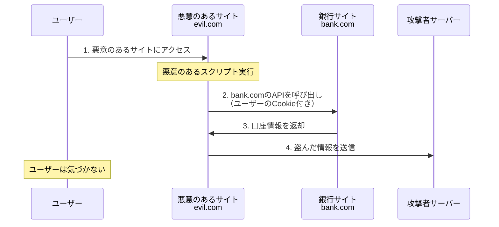

**なぜこの攻撃が成立するか**：
- ブラウザは `bank.com` へのリクエストに、ユーザーが以前ログインした際のCookieを自動付与する
- `evil.com` のスクリプトがレスポンスを読み取れれば、ユーザーの認証済みセッションを悪用できる

**同一オリジンポリシーにより、ステップ2でブラウザがレスポンスの読み取りをブロックします。**

### 制限されるもの・されないもの

| 操作 | 制限 | なぜこの判断か |
|-----|------|--------------|
| XMLHttpRequest / Fetch API | ⛔ 制限 | レスポンスの内容を読み取れるため、機密情報が漏洩する |
| `<script src="...">` | ✅ 許可 | 実行はできるが、スクリプトの内容（ソースコード）は読めない。CDNからのライブラリ読み込みに必要 |
| `` | ✅ 許可 | 表示はできるが、ピクセルデータは読めない。外部画像の埋め込みはWebの基本機能 |
| `<link href="...">` | ✅ 許可 | CSSは適用されるが、CSSのルール内容は読めない。CDNからのスタイルシート読み込みに必要 |
| `<iframe>` の内容へのアクセス | ⛔ 制限 | iframeのDOMを操作できると、埋め込んだサイトの内容を盗み見できる |
| Canvas での外部画像操作 | ⛔ 制限 | `getImageData()` でピクセルデータを読み取れるため、画像に埋め込まれた機密情報が漏洩する |

**なぜ `<script>` や `` は許可されているのか**：

これらのタグはWeb誕生時（1990年代）から存在し、クロスオリジンでの読み込みが前提で設計された。同一オリジンポリシー（1996年）より前から使われており、後方互換性のために許可されている。ただし「読み込み・実行はできるが、内容の読み取りはできない」という制限付き。

---

## CORSが解決する課題

### 課題：正当なクロスオリジン通信の必要性

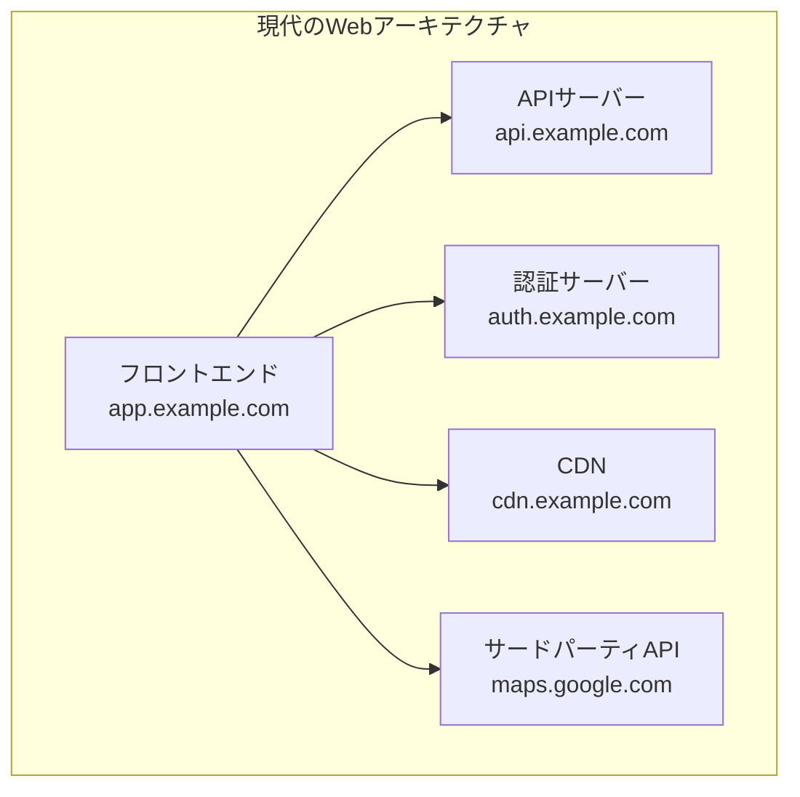

現代のWebアプリケーションでは、複数のオリジンと通信する必要がある：

| ユースケース | 例 | なぜ分離するか |
|------------|---|--------------|
| フロントエンドとAPIの分離 | `app.example.com` → `api.example.com` | スケーラビリティ：フロントとAPIを別サーバーで運用。チーム分離：フロントエンドチームとバックエンドチームで独立開発 |
| マイクロサービス | 複数のサービス間通信 | 各サービスを独立してデプロイ・スケール可能。障害の影響範囲を限定 |
| サードパーティAPI | Google Maps、決済サービス等 | 自前で実装するより、専門サービスを利用した方が高品質・低コスト |
| CDNからのリソース取得 | 静的ファイルの配信 | 地理的に分散したサーバーから配信し、レイテンシを削減 |

### CORSの解決策

CORSは「サーバー側が明示的に許可を与える」というアプローチを採用：

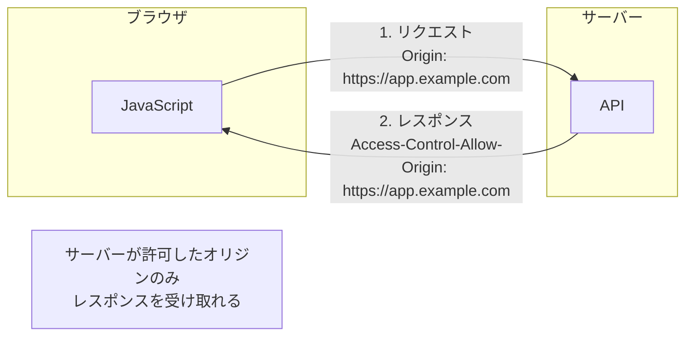

**なぜサーバー側で許可を与える設計なのか**：

| 代替案 | なぜ採用されなかったか |
|-------|---------------------|
| クライアント側で許可 | JavaScriptで偽装可能。悪意あるスクリプトが「自分は信頼できる」と宣言できてしまう |
| ブラウザベンダーが許可リスト管理 | 世界中のAPIを管理するのは不可能。新しいAPIが使えるまで待つ必要がある |
| ユーザーが毎回許可 | UXが最悪。ユーザーは技術的判断ができない |

**サーバー側で許可を与える利点**：
- APIの管理者が「誰を信頼するか」を決める権限を持つ（当然の権限配置）
- 新しいクライアントを許可する際、サーバー設定を変更するだけで済む
- 許可していないオリジンからのアクセスは自動的にブロックされる

---

## CORSの仕組み

### リクエストの種類

CORSでは、リクエストを2種類に分類します：

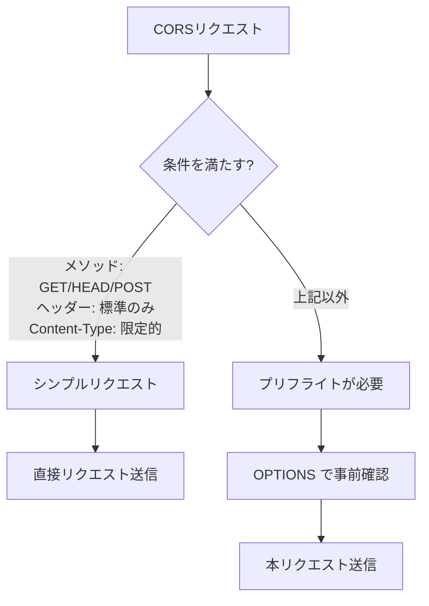

### シンプルリクエスト

以下の条件をすべて満たすリクエスト：

- メソッド: `GET`, `HEAD`, `POST` のいずれか
- ヘッダー: 以下のみ
  - `Accept`
  - `Accept-Language`
  - `Content-Language`
  - `Content-Type`（下記の値のみ）
- Content-Type: 以下のいずれか
  - `application/x-www-form-urlencoded`
  - `multipart/form-data`
  - `text/plain`

**なぜこれらの条件がシンプルリクエストなのか**：

これらは「HTMLフォームで送信可能なリクエスト」と一致します。

```html
<!-- HTMLフォームで送信可能 = CORSより前から可能だった -->
<form action="https://api.example.com/data" method="POST">
  <input type="text" name="key" value="value">
  <button type="submit">送信</button>
</form>
```

**なぜフォーム送信可能なリクエストにプリフライトが不要なのか**：

| 理由 | 説明 |
|-----|------|
| 後方互換性 | CORS導入前から、HTMLフォームによるクロスオリジンPOSTは可能だった。これを突然禁止すると既存のWebが壊れる |
| 既存の保護策 | サーバーは元々、フォーム送信による攻撃（CSRF）に対処している。CSRFトークン等の対策が存在 |
| プリフライトの目的 | プリフライトは「新しい種類のリクエスト」からサーバーを守るため。フォームで可能なリクエストは「新しくない」 |

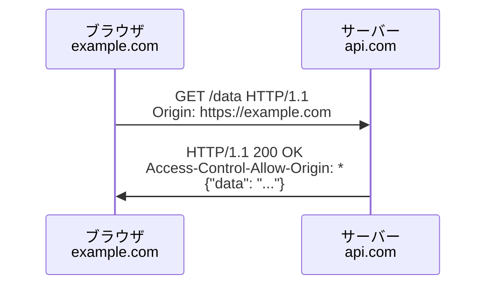

### プリフライトが必要なリクエスト

シンプルリクエストの条件を満たさないリクエスト（例：`PUT`, `DELETE`、カスタムヘッダー、`application/json` など）

**なぜこれらにプリフライトが必要なのか**：

| 条件 | なぜ危険か |
|-----|----------|
| `PUT`, `DELETE`, `PATCH` | HTMLフォームでは送信不可能。サーバーがこれらのメソッドを受け取る場合、「プログラムからのリクエスト」と想定している。CORS対応していないサーバーを守る必要がある |
| カスタムヘッダー | `Authorization` ヘッダー等はフォームでは送れない。これが送れるということは、プログラムからのリクエスト |
| `application/json` | フォームでは送れないContent-Type。REST APIの標準形式だが、CORS対応していないAPIを守る必要がある |

---

## プリフライトリクエスト

### 概要

プリフライトリクエストは、実際のリクエストを送る前に、サーバーがそのリクエストを許可するか確認する `OPTIONS` リクエストです。

### なぜプリフライトが必要か

**核心的な問題**：CORSはブラウザの機能だが、サーバーはCORSを知らないかもしれない。

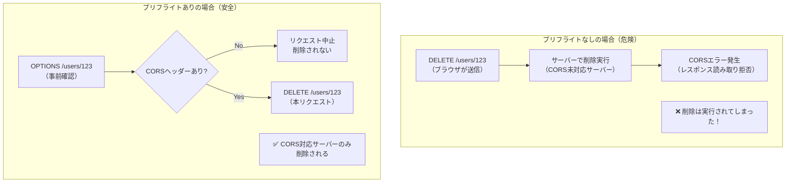

**なぜサーバーが削除を実行してしまうのか**：

CORS未対応のサーバーは、リクエストが来たら普通に処理してしまう。CORSはブラウザがレスポンスを読み取るかどうかの制御であり、サーバー側の処理は止められない。だからこそ、事前に「このリクエストを送っていいか」を確認する必要がある。

**なぜOPTIONSメソッドを使うのか**：

| 理由 | 説明 |
|-----|------|
| 副作用がない | OPTIONSは「このリソースで何ができるか」を問い合わせるメソッド。データを変更しない |
| 既存のHTTP仕様 | HTTP/1.1で定義済み。新しいメソッドを発明する必要がない |
| CORS未対応サーバーの挙動 | CORS未対応サーバーはOPTIONSに対してCORSヘッダーを返さない→ブラウザが本リクエストを中止 |

### フロー

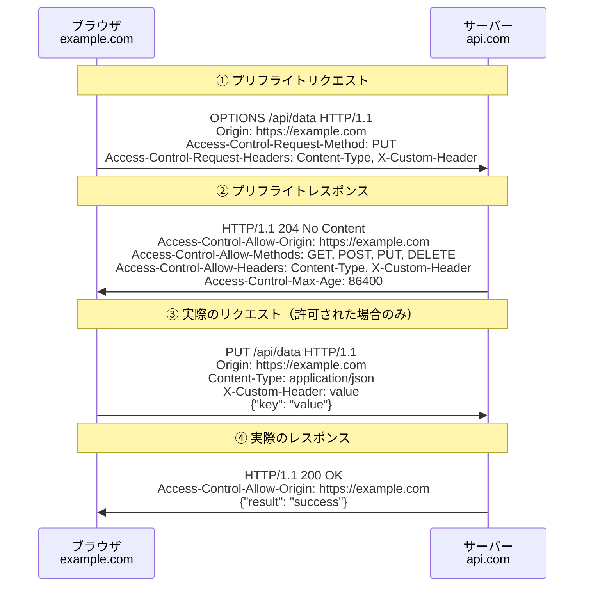

### プリフライトが発生する条件

| 条件 | 例 | なぜプリフライトが必要か |
|-----|---|----------------------|
| シンプルでないメソッド | `PUT`, `DELETE`, `PATCH` | フォームで送れない = CORS以前は不可能だった。CORS未対応サーバーを副作用から守る |
| カスタムヘッダー | `X-Custom-Header`, `Authorization` | フォームで送れない。認証ヘッダーを勝手に送られると、認証済みリクエストが偽造される |
| 特定のContent-Type | `application/json`, `application/xml` | フォームで送れない。JSONを受け付けるAPIは「プログラムからのリクエスト」前提で設計されている |

### なぜMax-Ageでキャッシュするのか

プリフライトは毎回送ると2倍のリクエストが発生し、パフォーマンスが悪化する。`Access-Control-Max-Age` でプリフライト結果をキャッシュすることで、一定期間は本リクエストのみで通信できる。

---

## CORSヘッダー

### リクエストヘッダー（ブラウザが自動付与）

| ヘッダー | 説明 | なぜ必要か |
|---------|------|----------|
| `Origin` | リクエスト元のオリジン | サーバーが「どのオリジンからのリクエストか」を判断するため |
| `Access-Control-Request-Method` | プリフライト時、実際に使用するメソッド | サーバーが「このメソッドを許可するか」を判断するため |
| `Access-Control-Request-Headers` | プリフライト時、実際に使用するヘッダー | サーバーが「このヘッダーを許可するか」を判断するため |

**なぜブラウザが自動付与するのか**：

JavaScriptで `Origin` ヘッダーを偽装できてしまうと、CORSの意味がなくなる。ブラウザが強制的に正しいオリジンを付与することで、サーバーは信頼できる情報を得られる。

### レスポンスヘッダー（サーバーが設定）

| ヘッダー | 説明 | 例 | なぜ必要か |
|---------|------|---|----------|
| `Access-Control-Allow-Origin` | 許可するオリジン | `https://example.com` または `*` | このオリジンからのアクセスを許可することを宣言 |
| `Access-Control-Allow-Methods` | 許可するHTTPメソッド | `GET, POST, PUT, DELETE` | プリフライト時、どのメソッドを許可するかを伝える |
| `Access-Control-Allow-Headers` | 許可するリクエストヘッダー | `Content-Type, Authorization` | プリフライト時、どのヘッダーを許可するかを伝える |
| `Access-Control-Allow-Credentials` | Cookie等の認証情報を許可するか | `true` | デフォルトでは認証情報は送られない。明示的に許可が必要 |
| `Access-Control-Expose-Headers` | JSからアクセス可能なレスポンスヘッダー | `X-Custom-Header` | デフォルトでは一部のヘッダーしか読めない。追加で公開するヘッダーを指定 |
| `Access-Control-Max-Age` | プリフライト結果のキャッシュ時間（秒） | `86400` | プリフライトの回数を減らしパフォーマンス向上 |

### ヘッダーの関係

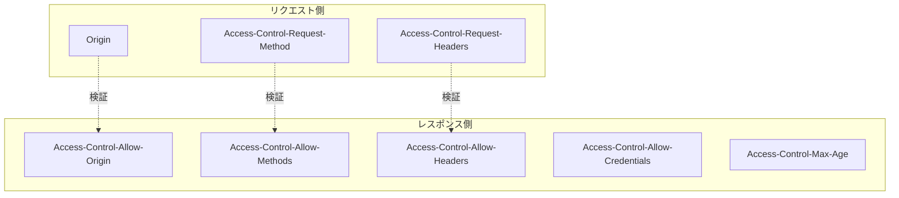

### 重要な制約

```
⚠️ Access-Control-Allow-Origin: * と
   Access-Control-Allow-Credentials: true は
   同時に使用できません！
```

**なぜこの制約があるのか**：

`*`（全オリジン許可）と認証情報の組み合わせは、「どのサイトからでも認証済みリクエストを送れる」ことを意味する。これは同一オリジンポリシーを完全に無効化するのと同じで、CORSの意味がなくなる。

認証情報を送る場合は、信頼できる具体的なオリジンを指定する必要がある。

---

## セキュリティ上の注意点

### 1. ワイルドカード（*）の使用を避ける

すべてのオリジンを許可する `*` は、公開APIでない限り避けるべきです。

**なぜ危険か**：
- どのサイトからでもAPIにアクセス可能になる
- 攻撃者のサイトからもリクエストを送れる
- レート制限等の対策が必要になる

**いつ使用してよいか**：
- 完全に公開されたAPI（天気情報等）
- 認証が不要なリソース
- 機密情報を含まないレスポンス

### 2. 認証情報を扱う場合

`Access-Control-Allow-Origin: *` と `Access-Control-Allow-Credentials: true` は同時に使用できません。

**なぜか**：上記「重要な制約」を参照。

### 3. オリジンの検証

リクエストの `Origin` ヘッダーをそのままレスポンスに反映するのは危険です。

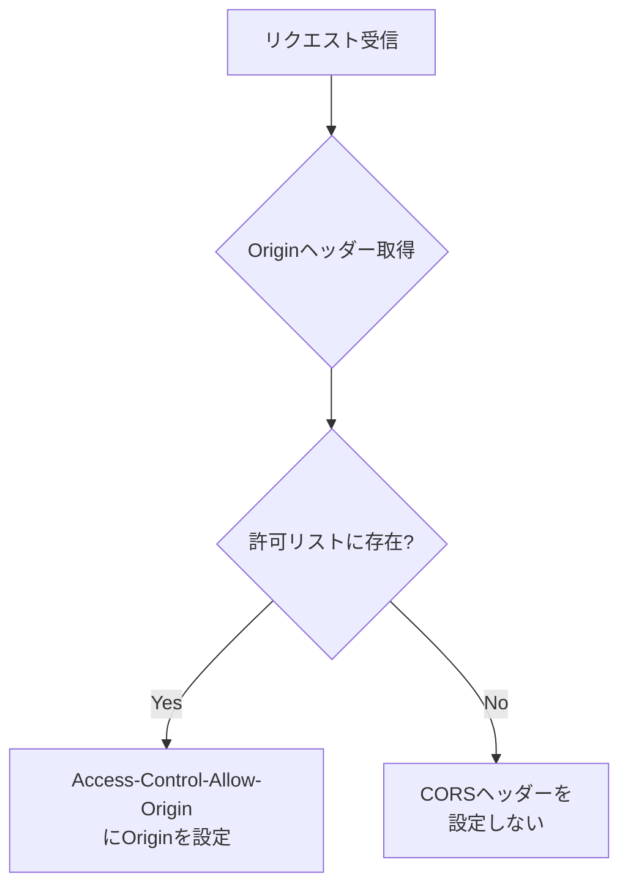

**なぜそのまま反映してはいけないか**：

```
// ❌ 危険なコード
origin := r.Header.Get("Origin")
w.Header().Set("Access-Control-Allow-Origin", origin)
```

これは実質的に `*` と同じ。攻撃者が `Origin: https://evil.com` を送ると、そのまま許可されてしまう。

### 4. 環境ごとの設定

本番環境と開発環境で異なるCORS設定を使用することを推奨します：

| 環境 | 設定 | なぜか |
|-----|------|-------|
| 本番環境 | 許可するオリジンを厳密に制限 | セキュリティを最優先 |
| 開発環境 | localhost からのアクセスを許可 | 開発効率を優先 |

---

## トラブルシューティング

### エラー発生時の確認フロー

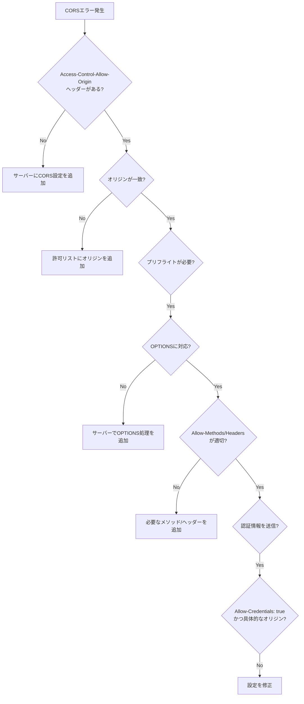

### よくあるエラーと解決方法

#### 1. "No 'Access-Control-Allow-Origin' header"

```
Access to fetch at 'https://api.example.com/data' from origin
'https://example.com' has been blocked by CORS policy:
No 'Access-Control-Allow-Origin' header is present on the requested resource.
```

**原因**: サーバーがCORSヘッダーを返していない

**なぜ発生するか**: サーバーがCORSに対応していない、またはCORS設定が正しくない

**解決方法**: サーバー側で `Access-Control-Allow-Origin` ヘッダーを設定する

#### 2. "The value of the 'Access-Control-Allow-Origin' header must not be '*'"

```
The value of the 'Access-Control-Allow-Origin' header in the response
must not be the wildcard '*' when the request's credentials mode is 'include'.
```

**原因**: 認証情報付きリクエストでワイルドカードを使用

**なぜ発生するか**: `fetch(url, { credentials: 'include' })` 等で認証情報を送信しているが、サーバーが `*` を返している

**解決方法**: 具体的なオリジンを指定し、`Access-Control-Allow-Credentials: true` と組み合わせる

#### 3. "Method PUT is not allowed"

```
Method PUT is not allowed by Access-Control-Allow-Methods in preflight response.
```

**原因**: プリフライトレスポンスでメソッドが許可されていない

**なぜ発生するか**: サーバーの `Access-Control-Allow-Methods` に `PUT` が含まれていない

**解決方法**: `Access-Control-Allow-Methods` ヘッダーに必要なメソッドを追加する

#### 4. "Request header field X-Custom-Header is not allowed"

```
Request header field X-Custom-Header is not allowed by
Access-Control-Allow-Headers in preflight response.
```

**原因**: カスタムヘッダーが許可されていない

**なぜ発生するか**: サーバーの `Access-Control-Allow-Headers` に該当ヘッダーが含まれていない

**解決方法**: `Access-Control-Allow-Headers` ヘッダーに必要なヘッダー名を追加する

### デバッグ方法

#### ブラウザの開発者ツール

1. Network タブを開く
2. リクエストを選択
3. Headers を確認
4. プリフライト（OPTIONS）リクエストも確認

**なぜOPTIONSリクエストを確認するか**：本リクエストがブロックされる原因は、多くの場合プリフライトの段階で許可されていないため。

#### curlでの確認

```bash
# プリフライトリクエストをシミュレート
curl -X OPTIONS https://api.example.com/data \
  -H "Origin: https://example.com" \
  -H "Access-Control-Request-Method: PUT" \
  -H "Access-Control-Request-Headers: Content-Type" \
  -v

# 実際のリクエスト
curl -X GET https://api.example.com/data \
  -H "Origin: https://example.com" \
  -v
```

**なぜcurlで確認するか**：ブラウザを介さずにサーバーの応答を直接確認できる。CORSヘッダーが正しく設定されているかを検証できる。

---

## まとめ

| 項目 | 内容 | なぜそうなっているか |
|-----|------|-------------------|
| CORSとは | 異なるオリジン間でリソースを共有するための仕組み | 同一オリジンポリシーの制限を安全に緩和するため |
| サーバー側で許可 | サーバーが明示的に許可を与えるアプローチ | サーバー管理者が「誰を信頼するか」を決める権限を持つべき |
| シンプルリクエスト | GET/HEAD/POST + 限定的なヘッダー → 直接リクエスト | HTMLフォームで可能だったリクエストは後方互換性のため許可 |
| プリフライト | それ以外 → OPTIONS で事前確認 | CORS未対応サーバーを副作用から保護するため |
| `*` と認証情報の禁止 | ワイルドカードと認証情報は併用不可 | 全オリジンに認証済みリクエストを許可するのは危険すぎる |

---

## 参考資料

- [MDN Web Docs - CORS](https://developer.mozilla.org/ja/docs/Web/HTTP/CORS)
- [Fetch Standard - CORS protocol](https://fetch.spec.whatwg.org/#cors-protocol)
- [W3C CORS Specification](https://www.w3.org/TR/cors/)
