# HTTPS/TLS 完全ガイド

Webセキュリティの基盤となるHTTPS/TLSの仕組みを解説します。

## 目次
1. [HTTPSとは](#httpsとは)
2. [TLSの概要](#tlsの概要)
3. [TLSハンドシェイク](#tlsハンドシェイク)
4. [証明書の仕組み](#証明書の仕組み)
5. [暗号化の種類](#暗号化の種類)
6. [TLS 1.3の改善点](#tls-13の改善点)
7. [Goでの実装例](#goでの実装例)

---

## HTTPSとは

**HTTPS**（HyperText Transfer Protocol Secure）は、HTTPにTLS/SSLによる暗号化を加えたプロトコルです。

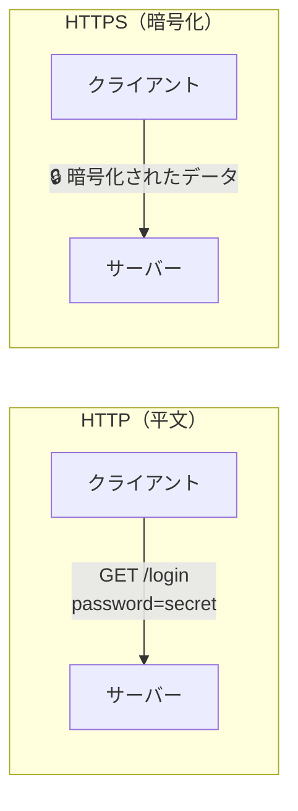

### HTTPとHTTPSの違い

| 項目 | HTTP | HTTPS |
|------|------|-------|
| ポート | 80 | 443 |
| 暗号化 | なし | TLS/SSL |
| データの可視性 | 平文（盗聴可能） | 暗号化（保護） |
| 認証 | なし | サーバー証明書 |
| 完全性 | なし | 改ざん検知 |

### HTTPSが提供する3つの保護

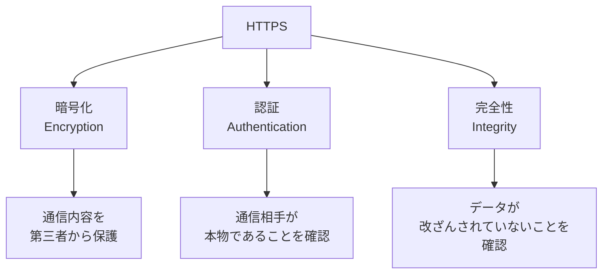

---

## TLSの概要

**TLS**（Transport Layer Security）は、通信を暗号化するためのプロトコルです。

### TLSのバージョン履歴

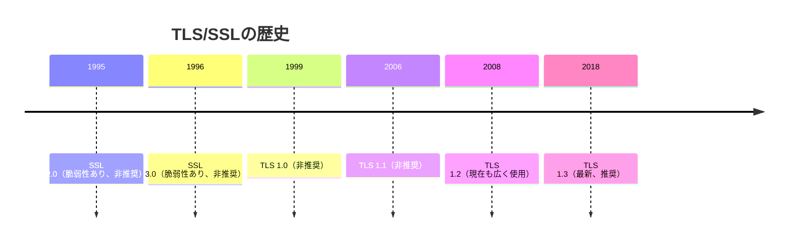

### TLSのレイヤー構造

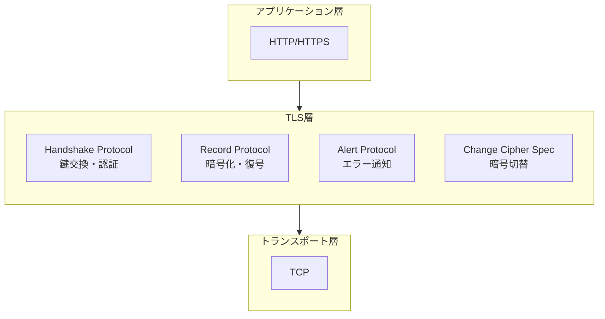

---

## TLSハンドシェイク

TLSハンドシェイクは、暗号化通信を確立するための手続きです。

### TLS 1.2 ハンドシェイク（フルハンドシェイク）

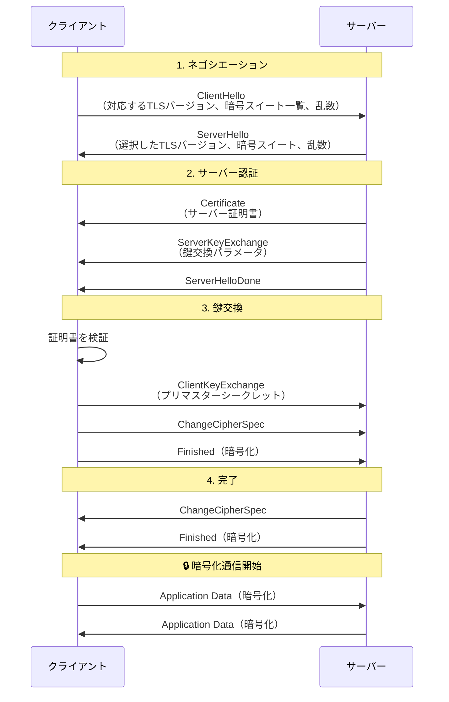

### ハンドシェイクの各ステップ詳細

#### Step 1: ClientHello

クライアントが送信する情報:

```
ClientHello {
    version: TLS 1.2
    random: 32バイトの乱数
    session_id: セッション再開用ID
    cipher_suites: [
        TLS_ECDHE_RSA_WITH_AES_256_GCM_SHA384,
        TLS_ECDHE_RSA_WITH_AES_128_GCM_SHA256,
        ...
    ]
    compression_methods: [null]
    extensions: [
        server_name: "example.com",
        supported_groups: [x25519, secp256r1],
        ...
    ]
}
```

#### Step 2: ServerHello + Certificate

サーバーが送信する情報:

```
ServerHello {
    version: TLS 1.2
    random: 32バイトの乱数
    session_id: セッションID
    cipher_suite: TLS_ECDHE_RSA_WITH_AES_256_GCM_SHA384
}

Certificate {
    certificate_list: [
        サーバー証明書,
        中間CA証明書,
        ...
    ]
}
```

#### Step 3: 鍵交換とマスターシークレット生成

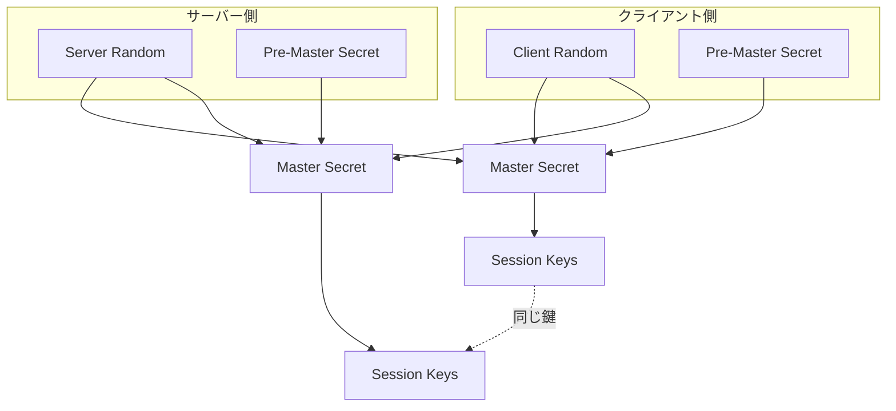

**Master Secret の計算:**
```
master_secret = PRF(pre_master_secret,
                    "master secret",
                    ClientHello.random + ServerHello.random)
```

---

## 証明書の仕組み

### 証明書チェーン

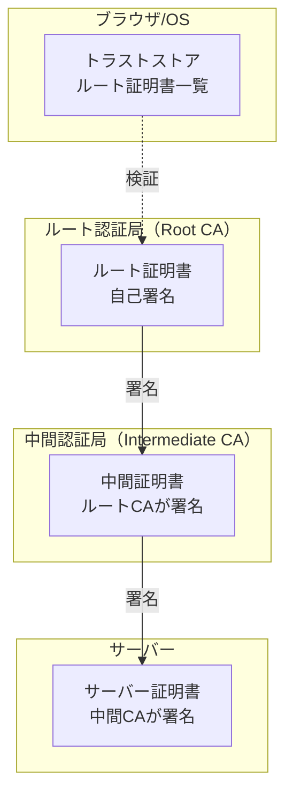

### 証明書の検証プロセス

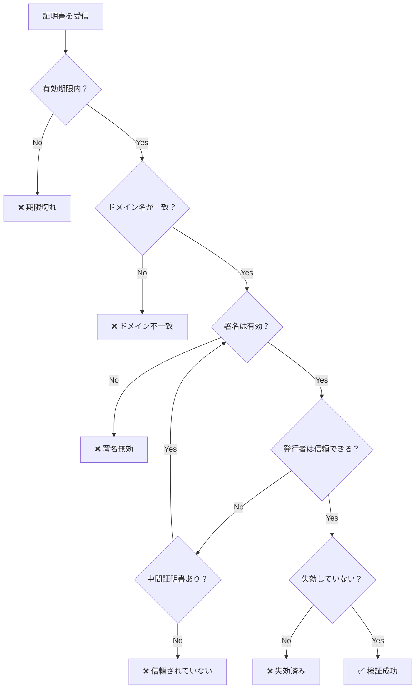

### X.509証明書の構造

```
Certificate {
    Version: 3
    Serial Number: 123456789...
    Signature Algorithm: sha256WithRSAEncryption
    Issuer: CN=Example CA, O=Example Inc
    Validity:
        Not Before: Jan 1 00:00:00 2024 GMT
        Not After:  Jan 1 00:00:00 2025 GMT
    Subject: CN=www.example.com, O=Example Inc
    Subject Public Key Info:
        Algorithm: rsaEncryption
        Public Key: (2048 bit)
    Extensions:
        Subject Alternative Name:
            DNS: www.example.com
            DNS: example.com
        Key Usage: Digital Signature, Key Encipherment
        Extended Key Usage: TLS Web Server Authentication
}
```

---

## 暗号化の種類

### 対称鍵暗号と公開鍵暗号

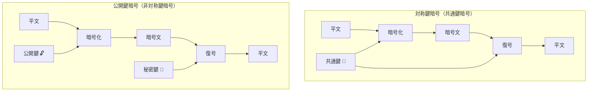

### TLSで使用される暗号

| 用途 | アルゴリズム | 例 |
|------|-------------|-----|
| 鍵交換 | DH, ECDH | ECDHE (Elliptic Curve Diffie-Hellman Ephemeral) |
| 認証 | RSA, ECDSA | RSA-2048, ECDSA P-256 |
| 暗号化 | AES, ChaCha20 | AES-256-GCM, ChaCha20-Poly1305 |
| ハッシュ | SHA | SHA-256, SHA-384 |

### 暗号スイートの読み方

```
TLS_ECDHE_RSA_WITH_AES_256_GCM_SHA384
│    │     │        │   │   │    │
│    │     │        │   │   │    └── ハッシュアルゴリズム
│    │     │        │   │   └────── 認証タグ（AEAD）
│    │     │        │   └────────── 鍵長
│    │     │        └────────────── 暗号化アルゴリズム
│    │     └─────────────────────── 認証アルゴリズム
│    └───────────────────────────── 鍵交換アルゴリズム
└────────────────────────────────── プロトコル
```

### Forward Secrecy（前方秘匿性）

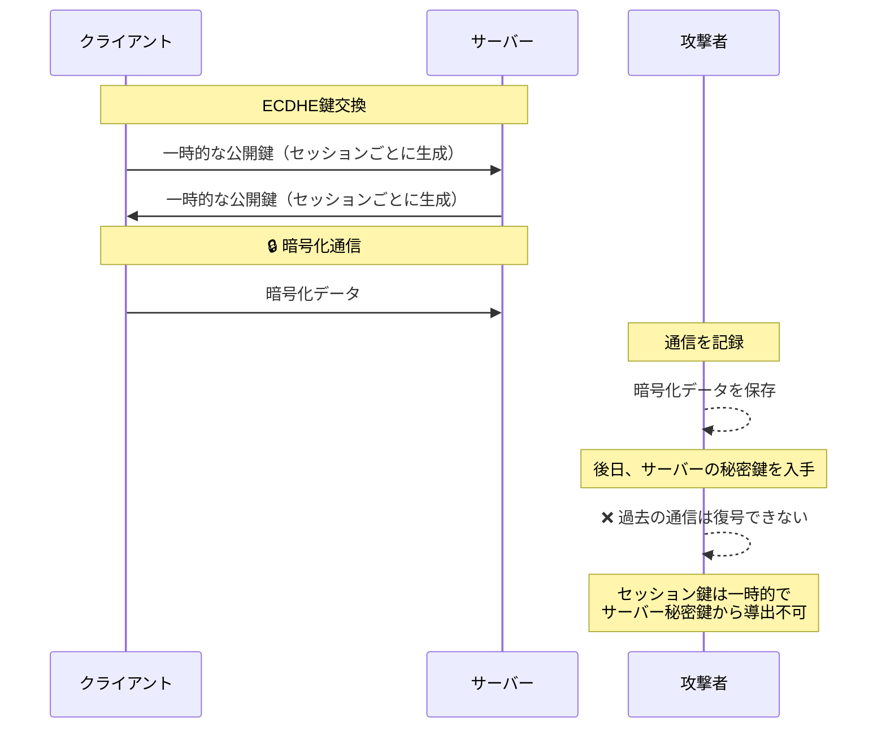

---

## TLS 1.3の改善点

### ハンドシェイクの高速化

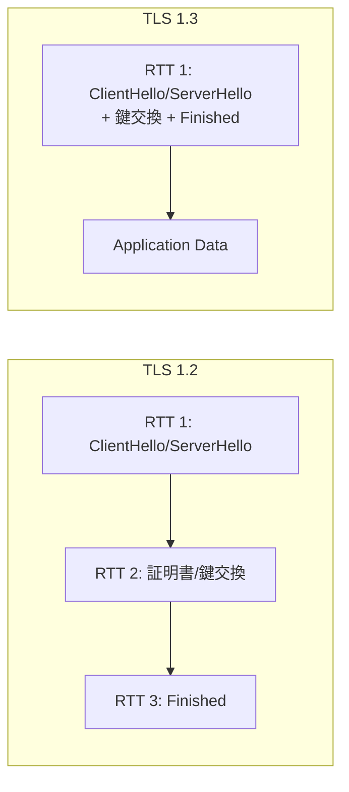

### TLS 1.3 ハンドシェイク

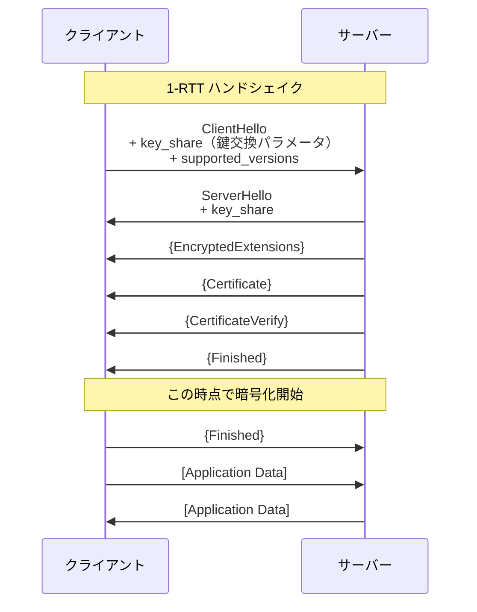

### 0-RTT（ゼロラウンドトリップ）

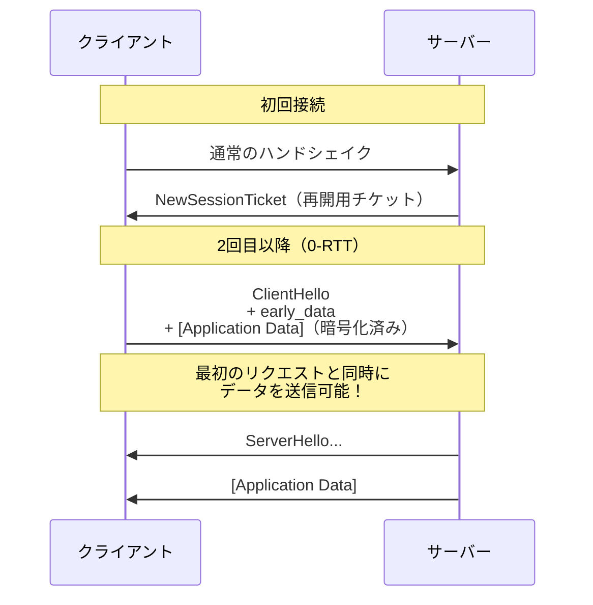

### TLS 1.2 vs TLS 1.3 比較

| 項目 | TLS 1.2 | TLS 1.3 |
|------|---------|---------|
| ハンドシェイクRTT | 2 RTT | 1 RTT (0-RTTも可能) |
| 暗号スイート | 多数（レガシー含む） | 5つのみ（安全なもの） |
| 鍵交換 | RSA, DH, ECDH | ECDHE, DHEのみ |
| Forward Secrecy | オプション | 必須 |
| 暗号化開始 | Finishedメッセージ後 | ServerHello直後 |

### TLS 1.3で削除された機能

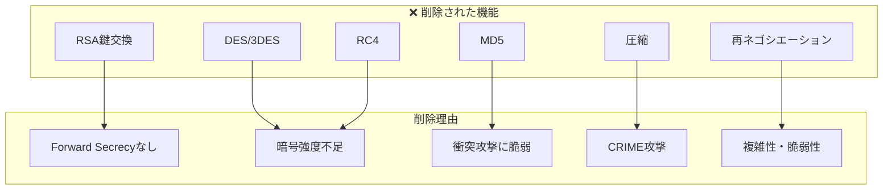

---

## Goでの実装例

### HTTPSサーバー（基本）

```go
package main

import (
    "crypto/tls"
    "log"
    "net/http"
)

func main() {
    mux := http.NewServeMux()
    mux.HandleFunc("/", func(w http.ResponseWriter, r *http.Request) {
        w.Write([]byte("Hello, HTTPS!"))
    })

    server := &http.Server{
        Addr:    ":443",
        Handler: mux,
        TLSConfig: &tls.Config{
            MinVersion: tls.VersionTLS12,
            CipherSuites: []uint16{
                tls.TLS_ECDHE_RSA_WITH_AES_256_GCM_SHA384,
                tls.TLS_ECDHE_RSA_WITH_AES_128_GCM_SHA256,
            },
        },
    }

    log.Println("Starting HTTPS server on :443")
    log.Fatal(server.ListenAndServeTLS("server.crt", "server.key"))
}
```

### TLS 1.3専用サーバー

```go
package main

import (
    "crypto/tls"
    "log"
    "net/http"
)

func main() {
    tlsConfig := &tls.Config{
        MinVersion: tls.VersionTLS13, // TLS 1.3以上を強制
        // TLS 1.3ではCipherSuitesは自動選択される
    }

    server := &http.Server{
        Addr:      ":443",
        TLSConfig: tlsConfig,
    }

    http.HandleFunc("/", handler)
    log.Fatal(server.ListenAndServeTLS("server.crt", "server.key"))
}
```

### 相互TLS認証（mTLS）

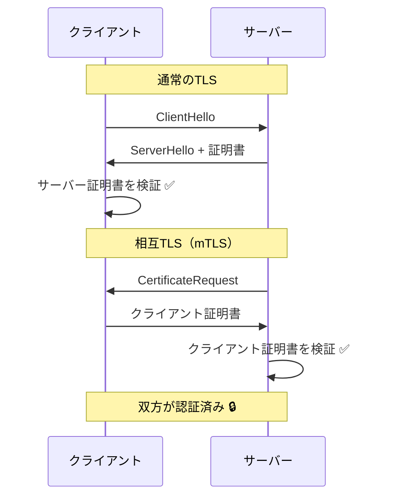

```go
package main

import (
    "crypto/tls"
    "crypto/x509"
    "log"
    "net/http"
    "os"
)

func main() {
    // クライアント証明書を検証するためのCAプール
    caCert, err := os.ReadFile("ca.crt")
    if err != nil {
        log.Fatal(err)
    }
    caCertPool := x509.NewCertPool()
    caCertPool.AppendCertsFromPEM(caCert)

    tlsConfig := &tls.Config{
        ClientCAs:  caCertPool,
        ClientAuth: tls.RequireAndVerifyClientCert, // クライアント証明書を必須に
        MinVersion: tls.VersionTLS12,
    }

    server := &http.Server{
        Addr:      ":443",
        TLSConfig: tlsConfig,
    }

    http.HandleFunc("/", func(w http.ResponseWriter, r *http.Request) {
        // クライアント証明書の情報を取得
        if len(r.TLS.PeerCertificates) > 0 {
            cert := r.TLS.PeerCertificates[0]
            log.Printf("Client: %s", cert.Subject.CommonName)
        }
        w.Write([]byte("Hello, mTLS!"))
    })

    log.Fatal(server.ListenAndServeTLS("server.crt", "server.key"))
}
```

### HTTPSクライアント

```go
package main

import (
    "crypto/tls"
    "crypto/x509"
    "fmt"
    "io"
    "log"
    "net/http"
    "os"
)

func main() {
    // カスタムCA証明書を読み込む場合
    caCert, err := os.ReadFile("ca.crt")
    if err != nil {
        log.Fatal(err)
    }
    caCertPool := x509.NewCertPool()
    caCertPool.AppendCertsFromPEM(caCert)

    client := &http.Client{
        Transport: &http.Transport{
            TLSClientConfig: &tls.Config{
                RootCAs:    caCertPool,
                MinVersion: tls.VersionTLS12,
            },
        },
    }

    resp, err := client.Get("https://example.com")
    if err != nil {
        log.Fatal(err)
    }
    defer resp.Body.Close()

    body, _ := io.ReadAll(resp.Body)
    fmt.Println(string(body))
}
```

### 自己署名証明書の生成

```go
package main

import (
    "crypto/ecdsa"
    "crypto/elliptic"
    "crypto/rand"
    "crypto/x509"
    "crypto/x509/pkix"
    "encoding/pem"
    "log"
    "math/big"
    "net"
    "os"
    "time"
)

func main() {
    // 秘密鍵を生成
    privateKey, err := ecdsa.GenerateKey(elliptic.P256(), rand.Reader)
    if err != nil {
        log.Fatal(err)
    }

    // 証明書テンプレート
    template := x509.Certificate{
        SerialNumber: big.NewInt(1),
        Subject: pkix.Name{
            Organization: []string{"Example Inc"},
            CommonName:   "localhost",
        },
        NotBefore:             time.Now(),
        NotAfter:              time.Now().Add(365 * 24 * time.Hour),
        KeyUsage:              x509.KeyUsageDigitalSignature | x509.KeyUsageKeyEncipherment,
        ExtKeyUsage:           []x509.ExtKeyUsage{x509.ExtKeyUsageServerAuth},
        BasicConstraintsValid: true,
        DNSNames:              []string{"localhost"},
        IPAddresses:           []net.IP{net.ParseIP("127.0.0.1")},
    }

    // 証明書を生成（自己署名）
    certDER, err := x509.CreateCertificate(rand.Reader, &template, &template, &privateKey.PublicKey, privateKey)
    if err != nil {
        log.Fatal(err)
    }

    // 証明書をPEM形式で保存
    certFile, _ := os.Create("server.crt")
    pem.Encode(certFile, &pem.Block{Type: "CERTIFICATE", Bytes: certDER})
    certFile.Close()

    // 秘密鍵をPEM形式で保存
    keyFile, _ := os.Create("server.key")
    keyBytes, _ := x509.MarshalECPrivateKey(privateKey)
    pem.Encode(keyFile, &pem.Block{Type: "EC PRIVATE KEY", Bytes: keyBytes})
    keyFile.Close()

    log.Println("Generated server.crt and server.key")
}
```

---

## よくある攻撃と対策

### 中間者攻撃（MITM）

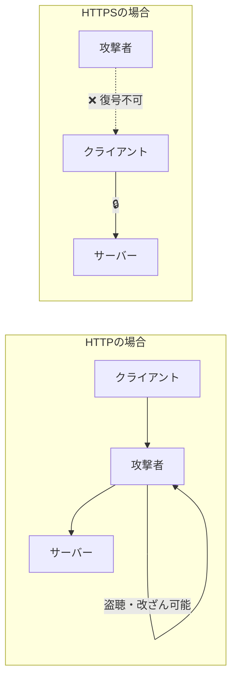

### ダウングレード攻撃

**攻撃:** 古い脆弱なプロトコルへの強制ダウングレード

**対策:**
```go
tlsConfig := &tls.Config{
    MinVersion: tls.VersionTLS12, // TLS 1.2未満を拒否
}
```

### 証明書の検証をスキップしない

```go
// ❌ 絶対にやってはいけない（開発時のみ）
tlsConfig := &tls.Config{
    InsecureSkipVerify: true, // 証明書の検証をスキップ
}

// ✅ 正しい方法
tlsConfig := &tls.Config{
    RootCAs:    caCertPool, // 信頼するCAを指定
    MinVersion: tls.VersionTLS12,
}
```

---

## ベストプラクティス

### サーバー設定のチェックリスト

- [ ] TLS 1.2以上を使用（TLS 1.3推奨）
- [ ] 強力な暗号スイートのみを有効化
- [ ] Forward Secrecyを有効化（ECDHE）
- [ ] 有効な証明書を使用（期限切れに注意）
- [ ] HSTSヘッダーを設定
- [ ] OCSP Staplingを有効化

### 推奨TLS設定（Go）

```go
tlsConfig := &tls.Config{
    MinVersion: tls.VersionTLS12,
    CurvePreferences: []tls.CurveID{
        tls.X25519,
        tls.CurveP256,
    },
    CipherSuites: []uint16{
        // TLS 1.3の暗号スイート（自動選択）
        // TLS 1.2の暗号スイート
        tls.TLS_ECDHE_ECDSA_WITH_AES_256_GCM_SHA384,
        tls.TLS_ECDHE_RSA_WITH_AES_256_GCM_SHA384,
        tls.TLS_ECDHE_ECDSA_WITH_AES_128_GCM_SHA256,
        tls.TLS_ECDHE_RSA_WITH_AES_128_GCM_SHA256,
        tls.TLS_ECDHE_ECDSA_WITH_CHACHA20_POLY1305,
        tls.TLS_ECDHE_RSA_WITH_CHACHA20_POLY1305,
    },
}
```

---

## 参考資料

- [RFC 8446 - TLS 1.3](https://tools.ietf.org/html/rfc8446)
- [Go crypto/tls パッケージ](https://pkg.go.dev/crypto/tls)
- [Mozilla SSL Configuration Generator](https://ssl-config.mozilla.org/)
- [SSL Labs Server Test](https://www.ssllabs.com/ssltest/)
