# URLを叩くと何が起きるか - 完全ガイド

ブラウザでURLを入力してからWebページが表示されるまでの全プロセスを解説します。

## 目次
1. [全体フロー概要](#全体フロー概要)
2. [Step 1: URL解析](#step-1-url解析)
3. [Step 2: DNS解決](#step-2-dns解決)
4. [Step 3: TCP接続](#step-3-tcp接続)
5. [Step 4: TLSハンドシェイク](#step-4-tlsハンドシェイク)
6. [Step 5: HTTPリクエスト送信](#step-5-httpリクエスト送信)
7. [Step 6: サーバー処理](#step-6-サーバー処理)
8. [Step 7: HTTPレスポンス受信](#step-7-httpレスポンス受信)
9. [Step 8: ブラウザレンダリング](#step-8-ブラウザレンダリング)
10. [まとめ](#まとめ)

---

## 全体フロー概要

ブラウザでURLを入力してからページが表示されるまでには、多くのステップが実行されます。

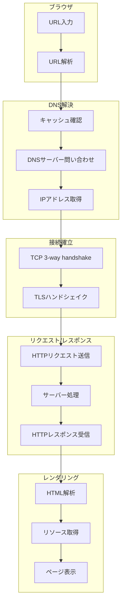

---

## Step 1: URL解析

### URLの構造

ブラウザはまず入力されたURLを解析し、各コンポーネントを識別します。

```
https://www.example.com:443/path/to/page?query=value#section
└─┬──┘ └──────┬───────┘└┬┘ └────┬────┘ └────┬────┘ └──┬───┘
  │           │         │       │           │         │
scheme     host       port    path        query    fragment
```

| コンポーネント | 説明 | 例 |
|--------------|------|-----|
| scheme | プロトコル | `https`, `http` |
| host | ドメイン名またはIPアドレス | `www.example.com` |
| port | ポート番号（省略時はデフォルト） | `443`（HTTPS）, `80`（HTTP） |
| path | リソースへのパス | `/path/to/page` |
| query | クエリパラメータ | `query=value` |
| fragment | ページ内の位置 | `section` |

### ブラウザキャッシュの確認

URL解析後、ブラウザは以下の順序でキャッシュを確認します：

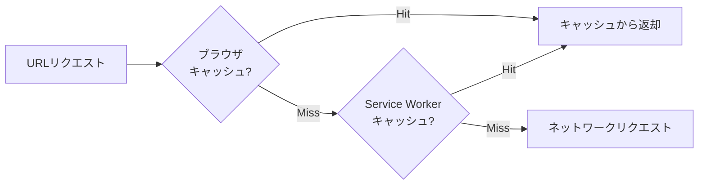

---

## Step 2: DNS解決

### DNSとは

**DNS**（Domain Name System）は、人間が読めるドメイン名をIPアドレスに変換するシステムです。

### 解決すべき課題

| 課題 | DNSによる解決 |
|-----|-------------|
| IPアドレスは覚えにくい | ドメイン名（例: google.com）で接続可能に |
| サーバーIPの変更 | DNSレコードの更新で対応、ユーザーは意識不要 |
| 負荷分散 | 複数IPへの振り分けが可能 |

### DNS解決の流れ

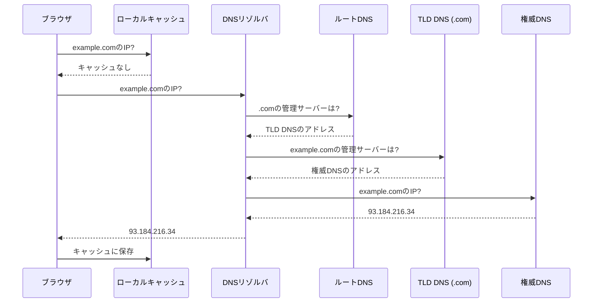

### DNSレコードの種類

| レコード | 用途 | 例 |
|---------|------|-----|
| A | ドメイン → IPv4 | `example.com → 93.184.216.34` |
| AAAA | ドメイン → IPv6 | `example.com → 2001:db8::1` |
| CNAME | ドメインの別名 | `www.example.com → example.com` |
| MX | メールサーバー | `example.com → mail.example.com` |
| NS | ネームサーバー | `example.com → ns1.example.com` |

### DNSキャッシュの階層

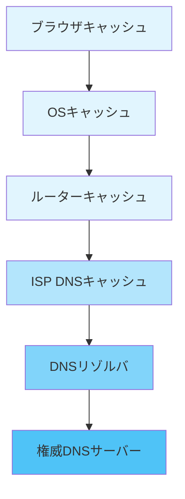

---

## Step 3: TCP接続

### TCPとは

**TCP**（Transmission Control Protocol）は、信頼性のあるデータ転送を提供するプロトコルです。

### 解決すべき課題

| 課題 | TCPによる解決 |
|-----|-------------|
| パケットロス | 再送制御で確実に届ける |
| パケットの順序乱れ | シーケンス番号で順序を保証 |
| データ破損 | チェックサムで検証 |
| 輻輳（ネットワーク混雑） | フロー制御・輻輳制御 |

### 3-way handshake

TCPでは接続確立のために3つのパケットをやり取りします。

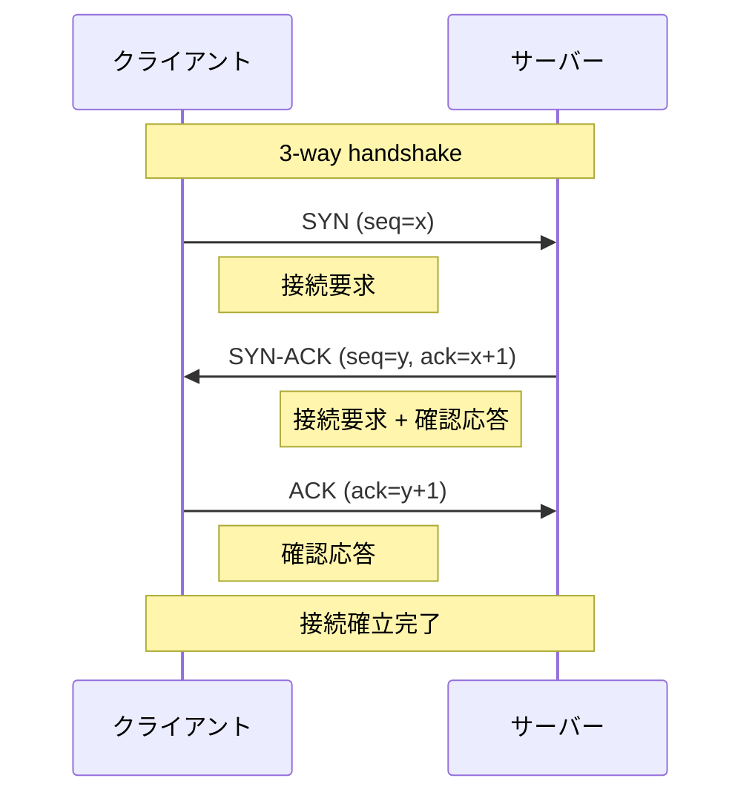

### なぜ3-wayなのか

| 目的 | 説明 |
|-----|------|
| 双方向の通信確認 | クライアント→サーバー、サーバー→クライアント両方の疎通確認 |
| 初期シーケンス番号の交換 | データの順序制御のため |
| なりすまし防止 | シーケンス番号による検証 |

---

## Step 4: TLSハンドシェイク

### TLSとは

**TLS**（Transport Layer Security）は、通信を暗号化するプロトコルです。HTTPSではTCPの上にTLSを使用します。

### 解決すべき課題

| 課題 | TLSによる解決 |
|-----|-------------|
| 盗聴 | 通信の暗号化 |
| なりすまし | 証明書による認証 |
| 改ざん | メッセージ認証コード（MAC） |

### TLS 1.3 ハンドシェイク

TLS 1.3では往復回数が削減され、高速化されています。

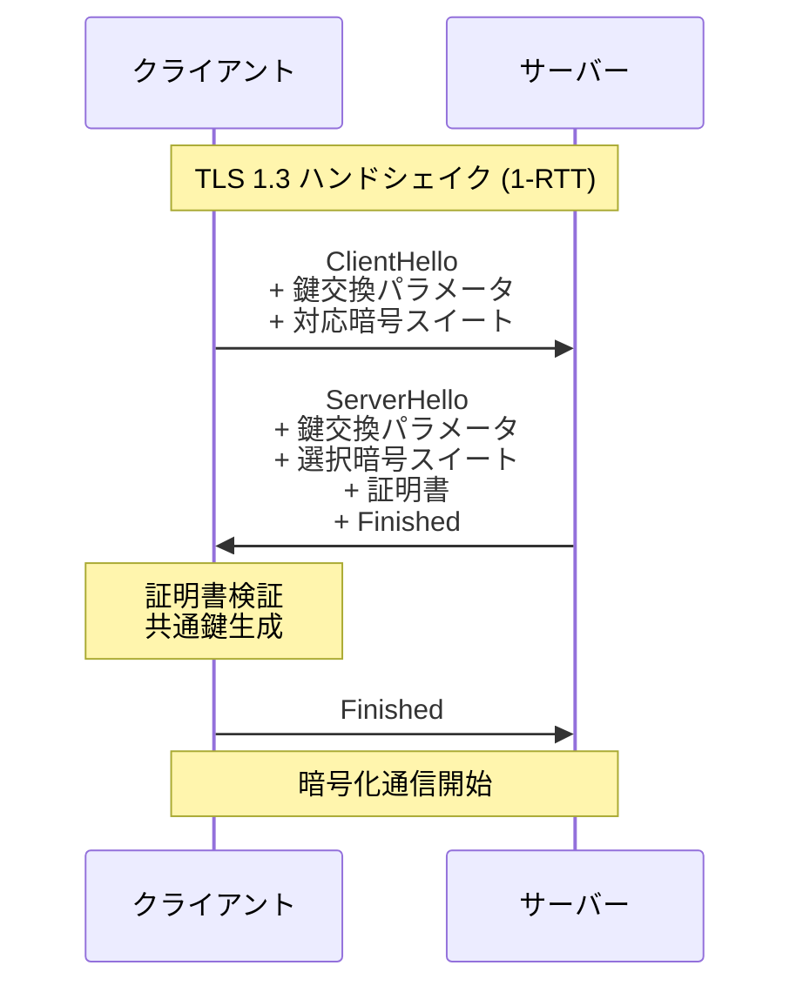

### プロトコルスタック

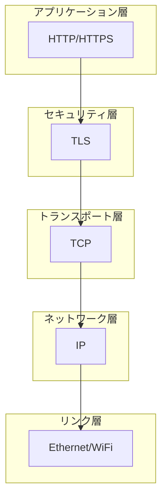

---

## Step 5: HTTPリクエスト送信

### HTTPリクエストの構造

```
GET /path/to/page HTTP/1.1
Host: www.example.com
User-Agent: Mozilla/5.0 ...
Accept: text/html,application/xhtml+xml
Accept-Language: ja,en;q=0.9
Accept-Encoding: gzip, deflate, br
Connection: keep-alive
Cookie: session_id=abc123
```

### リクエストの構成要素

| 要素 | 説明 | 例 |
|-----|------|-----|
| メソッド | 操作の種類 | `GET`, `POST`, `PUT`, `DELETE` |
| パス | リソースの場所 | `/path/to/page` |
| HTTPバージョン | プロトコルバージョン | `HTTP/1.1`, `HTTP/2` |
| ヘッダー | メタ情報 | `Host`, `User-Agent`, `Accept` |
| ボディ | リクエストデータ | POSTデータなど |

### HTTP/1.1 vs HTTP/2 vs HTTP/3

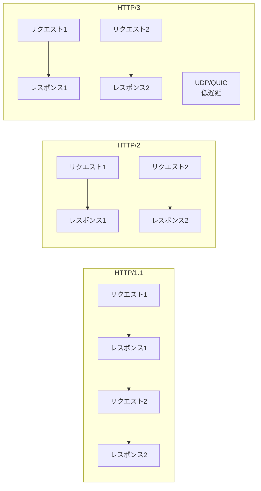

| バージョン | 特徴 |
|-----------|------|
| HTTP/1.1 | 1リクエストずつ順番に処理（Head-of-Line Blocking） |
| HTTP/2 | 1接続で複数リクエストを多重化（ストリーム） |
| HTTP/3 | UDP/QUICベースで接続確立が高速、パケットロス耐性向上 |

---

## Step 6: サーバー処理

### サーバーがリクエストを処理する流れ

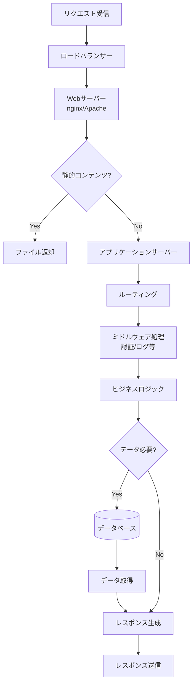

### 主要コンポーネント

| コンポーネント | 役割 | 例 |
|--------------|------|-----|
| ロードバランサー | リクエストの分散 | AWS ALB, nginx |
| リバースプロキシ | キャッシュ、SSL終端 | nginx, Cloudflare |
| Webサーバー | HTTPリクエスト処理 | nginx, Apache |
| アプリケーションサーバー | ビジネスロジック | Go, Node.js, Python |
| データベース | データ永続化 | PostgreSQL, MySQL |
| キャッシュ | 高速データアクセス | Redis, Memcached |

---

## Step 7: HTTPレスポンス受信

### HTTPレスポンスの構造

```
HTTP/1.1 200 OK
Date: Wed, 05 Feb 2026 12:00:00 GMT
Content-Type: text/html; charset=utf-8
Content-Length: 1234
Content-Encoding: gzip
Cache-Control: max-age=3600
Connection: keep-alive

<!DOCTYPE html>
<html>
  <head>...</head>
  <body>...</body>
</html>
```

### 主要なステータスコード

| コード | 意味 | 説明 |
|-------|------|------|
| 200 | OK | 正常終了 |
| 301 | Moved Permanently | 恒久的リダイレクト |
| 302 | Found | 一時的リダイレクト |
| 304 | Not Modified | キャッシュ利用可 |
| 400 | Bad Request | リクエスト不正 |
| 401 | Unauthorized | 認証必要 |
| 403 | Forbidden | アクセス拒否 |
| 404 | Not Found | リソース不在 |
| 500 | Internal Server Error | サーバー内部エラー |
| 503 | Service Unavailable | サービス一時停止 |

### レスポンスヘッダーの重要なもの

| ヘッダー | 用途 |
|---------|------|
| Content-Type | コンテンツのMIMEタイプ |
| Content-Encoding | 圧縮方式（gzip等） |
| Cache-Control | キャッシュ制御 |
| Set-Cookie | Cookie設定 |
| Content-Security-Policy | XSS対策 |
| Strict-Transport-Security | HTTPS強制 |

---

## Step 8: ブラウザレンダリング

### レンダリングプロセス

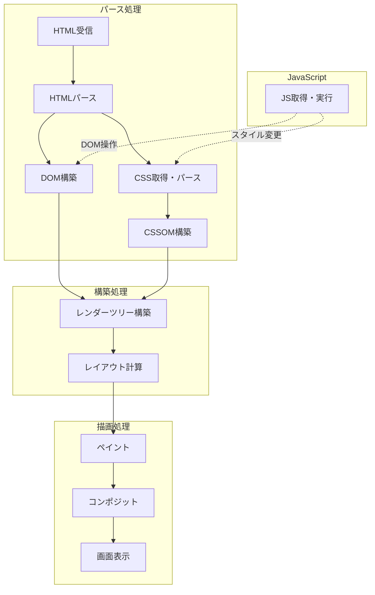

### レンダリングの各ステップ

| ステップ | 説明 |
|---------|------|
| DOM構築 | HTMLをパースしてDocument Object Modelを構築 |
| CSSOM構築 | CSSをパースしてCSS Object Modelを構築 |
| レンダーツリー | DOMとCSSOMを結合して表示用ツリーを生成 |
| レイアウト | 各要素の位置とサイズを計算 |
| ペイント | 実際のピクセルを描画 |
| コンポジット | レイヤーを合成して最終画像を生成 |

### Critical Rendering Path

ページ表示を高速化するために重要なリソースを優先的に読み込みます。

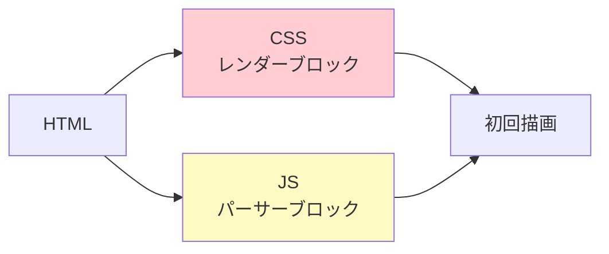

| リソース | 特性 | 最適化 |
|---------|------|--------|
| CSS | レンダーブロック | head内で読み込み、クリティカルCSSをインライン化 |
| JavaScript | パーサーブロック | async/deferを使用、body末尾に配置 |
| 画像 | 非ブロック | lazy loading、適切なサイズ指定 |
| フォント | レンダーに影響 | font-display: swap、preload |

---

## まとめ

### 全体の処理時間の目安

| ステップ | 通常の所要時間 |
|---------|---------------|
| DNS解決 | 20-120ms |
| TCP接続 | 20-100ms（往復時間） |
| TLSハンドシェイク | 30-150ms（1-2 RTT） |
| HTTPリクエスト/レスポンス | 50-500ms |
| ブラウザレンダリング | 100-1000ms |
| **合計** | **約200ms〜2秒以上** |

### パフォーマンス最適化のポイント

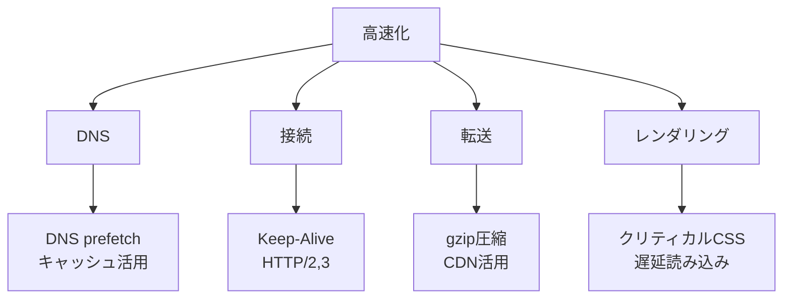

### 各ステップと関連技術

| ステップ | 関連技術・仕様 |
|---------|---------------|
| URL解析 | URL Standard (WHATWG) |
| DNS解決 | DNS, DNS over HTTPS (DoH) |
| TCP接続 | TCP, RFC 793 |
| TLS | TLS 1.3 (RFC 8446) |
| HTTP | HTTP/1.1, HTTP/2, HTTP/3 |
| レンダリング | DOM, CSSOM, Layout, Paint |

---

## 技術の歴史と意義

### なぜこれらの技術が必要だったのか

| 技術 | 登場年 | 解決した課題 |
|-----|-------|-------------|
| DNS | 1983年 | hosts.txtの手動管理の限界、インターネットの急速な成長 |
| TCP | 1974年 | 信頼性のないネットワーク上での確実なデータ転送 |
| HTTP | 1991年 | ハイパーテキストの転送プロトコルの標準化 |
| SSL/TLS | 1995年 | インターネット商取引における通信の安全性 |
| HTTP/2 | 2015年 | HTTP/1.1のHead-of-Line Blocking問題、多重化の必要性 |
| HTTP/3 | 2022年 | TCP上のHoL Blocking解消、モバイル環境での接続切り替え |

これらの技術は、インターネットの成長と共に、スケーラビリティ、セキュリティ、パフォーマンスの課題を解決するために発展してきました。
